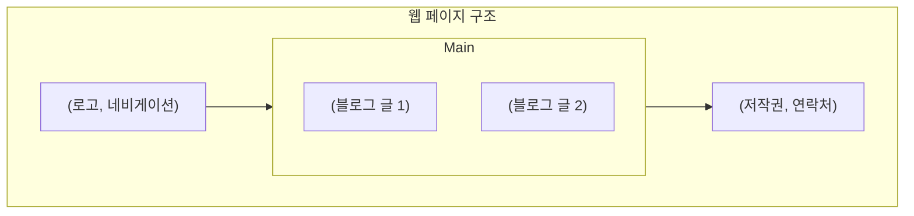

---
tags:
  - html
  - media
  - layout
  - semantic
---

# 02. 미디어와 레이아웃

웹 페이지를 풍부하게 만드는 미디어(이미지, 비디오, 오디오) 요소를 삽입하는 방법과, 콘텐츠를 의미 있는 구획으로 나누는 시맨틱 레이아웃 태그에 대해 알아봅니다.

#학습목표

- `` 태그를 사용하여 웹 페이지에 이미지를 삽입하고, 필수 속성인 `src`와 `alt`의 역할을 이해합니다.
- `<video>`와 `<audio>` 태그로 비디오 및 오디오 콘텐츠를 삽입하고 제어할 수 있습니다.
- `<div>`와 `<span>`의 차이점을 이해하고, 시맨틱 태그(`<header>`, `<main>`, `<footer>` 등)를 사용하여 문서의 구조를 의미론적으로 설계할 수 있습니다.

---

## 1. 이미지(Image)

#이미지 #image #아이엠지

`` 태그는 웹 페이지에 이미지를 삽입할 때 사용합니다. 종료 태그가 없는 빈 태그(Empty Tag)입니다.

- **`src` (Source) 속성**: 이미지 파일의 경로를 지정하는 **필수 속성**입니다. 웹 URL 또는 로컬 파일 경로를 사용할 수 있습니다.
- **`alt` (Alternative Text) 속성**: 이미지를 표시할 수 없을 때(예: 경로 오류, 네트워크 문제) 대신 표시될 텍스트입니다. 스크린 리더 사용자를 위해 이미지에 대한 설명을 제공하는 중요한 **웹 접근성** 요소이므로 반드시 작성해야 합니다.
- **`width` / `height` 속성**: 이미지의 너비와 높이를 지정합니다. 픽셀(px) 단위로 설정하며, CSS로 제어하는 것이 더 일반적입니다.
- **`loading="lazy"` 속성**: 사용자가 스크롤하여 이미지가 화면에 보이기 직전까지 로딩을 지연시킵니다. 페이지 초기 로딩 성능을 개선하는 데 도움이 됩니다.

### 실습 예제: `04_images.html`

```html
<!DOCTYPE html>
<html lang="ko">
  <head>
    <meta charset="UTF-8" />
    <title>이미지 삽입</title>
  </head>
  <body>
    <h1>귀여운 고양이 이미지</h1>

    <!-- 웹 상의 이미지 URL 사용 -->
    

    <!-- alt 텍스트의 중요성: 경로가 잘못되었을 때 표시됨 -->
    <h2>경로가 잘못된 경우</h2>
    
  </body>
</html>
```

---

## 2. 비디오(Video)와 오디오(Audio)

#비디오 #video #오디오 #audio

HTML5부터는 플러그인 없이도 비디오와 오디오를 직접 재생할 수 있는 태그를 지원합니다.

- **`<video>`**: 비디오 콘텐츠를 삽입합니다.
- **`<audio>`**: 오디오 콘텐츠를 삽입합니다.

### 주요 속성

| 속성             | 설명                                                                             | 적용 태그        |
| ---------------- | -------------------------------------------------------------------------------- | ---------------- |
| `src`            | 미디어 파일의 경로를 지정합니다.                                                 | `video`, `audio` |
| `controls`       | 재생, 정지, 볼륨 조절 등 컨트롤 바를 표시합니다.                                 | `video`, `audio` |
| `autoplay`       | 페이지 로드 시 자동으로 재생합니다. (대부분의 브라우저는 음소거 상태에서만 허용) | `video`, `audio` |
| `loop`           | 재생이 끝나면 자동으로 다시 시작합니다.                                          | `video`, `audio` |
| `muted`          | 음소거 상태로 설정합니다. `autoplay`를 위해 필요할 수 있습니다.                  | `video`, `audio` |
| `poster`         | 비디오가 재생되기 전에 표시될 이미지 파일의 경로를 지정합니다.                   | `video`          |
| `width`/`height` | 비디오 플레이어의 크기를 지정합니다.                                             | `video`          |

### 실습 예제: `05_media.html`

```html
<!DOCTYPE html>
<html lang="ko">
  <head>
    <meta charset="UTF-8" />
    <title>비디오와 오디오</title>
  </head>
  <body>
    <h1>비디오 재생</h1>
    <video src="sample.mp4" controls width="600" poster="thumbnail.jpg">
      이 브라우저는 video 태그를 지원하지 않습니다.
    </video>

    <h1>오디오 재생</h1>
    <audio src="sample.mp3" controls>
      이 브라우저는 audio 태그를 지원하지 않습니다.
    </audio>
  </body>
</html>
```

_참고: `sample.mp4`, `sample.mp3`, `thumbnail.jpg` 파일은 직접 준비해야 합니다._

---

## 3. 레이아웃(Layout)과 시맨틱 태그

#레이아웃 #layout #시맨틱 #semantic

과거에는 `<div>` 태그만으로 웹 페이지의 전체 레이아웃을 구성했지만, 이는 코드의 가독성을 떨어뜨리고 검색 엔진이 문서의 구조를 이해하기 어렵게 만듭니다. HTML5에서는 각 구획의 '의미'를 명확히 나타내는 **시맨틱(Semantic) 태그** 사용을 권장합니다.

### `<div>` vs `<span>`

- **`<div>` (Division)**: 블록(Block) 레벨 요소. 특별한 의미 없이 콘텐츠를 그룹화하거나 레이아웃을 나눌 때 사용하는 범용 컨테이너입니다. 한 줄 전체를 차지합니다.
- **`<span>`**: 인라인(Inline) 레벨 요소. 특별한 의미 없이 텍스트의 일부를 그룹화하여 스타일을 적용하거나 스크립트로 제어할 때 사용합니다. 콘텐츠의 크기만큼만 공간을 차지합니다.

### 주요 시맨틱 태그

- `<header>`: 페이지나 특정 섹션의 머리말 영역. 주로 로고, 제목, 네비게이션 메뉴가 포함됩니다.
- `<nav>` (Navigation): 다른 페이지나 페이지 내 다른 부분으로 연결되는 링크(메뉴)들의 집합.
- `<main>`: 문서의 핵심 콘텐츠. 한 페이지에 단 한 번만 사용해야 합니다.
- `<section>`: 문서의 독립적인 구획. 주제별로 콘텐츠를 그룹화하며, 보통 제목(`<h1>`~`<h6>`)을 포함합니다.
- `<article>`: 그 자체로 독립적으로 배포하거나 재사용할 수 있는 콘텐츠. (예: 블로그 포스트, 뉴스 기사)
- `<aside>`: 문서의 주요 내용과 간접적으로만 관련된 부분. (예: 사이드바, 광고, 관련 링크)
- `<footer>`: 페이지나 특정 섹션의 꼬리말 영역. 주로 저작권 정보, 연락처, 관련 문서 링크가 포함됩니다.

### 시맨틱 레이아웃 구조 예시



### 실습 예제: `06_semantic_layout.html`

```html
<!DOCTYPE html>
<html lang="ko">
  <head>
    <meta charset="UTF-8" />
    <title>시맨틱 레이아웃</title>
    <style>
      /* 간단한 시각화를 위한 CSS */
      body {
        font-family: sans-serif;
      }
      header,
      footer {
        background-color: #f2f2f2;
        padding: 10px;
        text-align: center;
      }
      nav a {
        margin: 0 15px;
      }
      main {
        padding: 20px;
      }
      section {
        border: 1px solid #ccc;
        padding: 15px;
        margin-bottom: 20px;
      }
    </style>
  </head>
  <body>
    <header>
      <h1>My Blog</h1>
      <nav>
        <a href="#">홈</a>
        <a href="#">소개</a>
        <a href="#">연락처</a>
      </nav>
    </header>

    <main>
      <article>
        <h2>첫 번째 블로그 글</h2>
        <p>이것은 첫 번째 글의 내용입니다...</p>
        <section>
          <h3>댓글</h3>
          <p>첫 번째 댓글입니다.</p>
        </section>
      </article>

      <article>
        <h2>두 번째 블로그 글</h2>
        <p>이것은 두 번째 글의 내용입니다...</p>
      </article>
    </main>

    <footer>
      <p>&copy; 2024 My Blog. All rights reserved.</p>
    </footer>
  </body>
</html>
```

다음 문서에서는 사용자로부터 정보를 입력받기 위한 `폼(Form)` 관련 태그들에 대해 자세히 알아보겠습니다.
