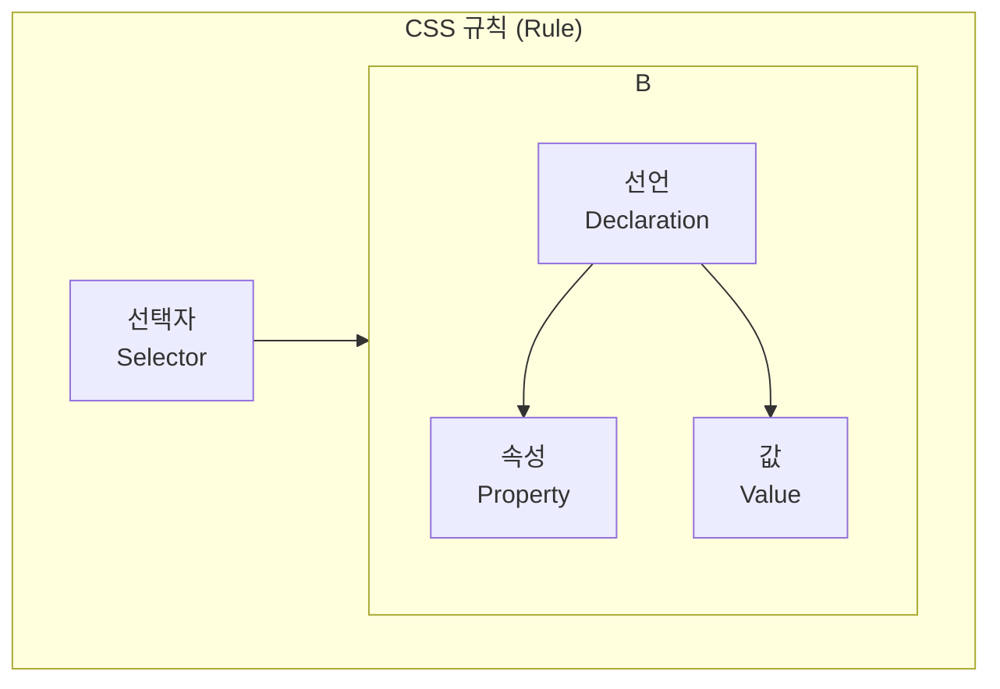

---
tags:
  - css
  - web
  - frontend
  - design
---

# 00. CSS 개요 및 적용법

HTML이 웹 페이지의 구조(뼈대)를 정의한다면, **CSS(Cascading Style Sheets)**는 그 구조를 시각적으로 꾸미는 역할을 담당합니다. 이 문서에서는 CSS의 기본 개념과 문법, 그리고 HTML에 스타일을 적용하는 세 가지 방법에 대해 알아봅니다.

#학습목표

- CSS의 정의와 웹 개발에서의 역할을 설명할 수 있습니다.
- CSS의 기본 문법 구조(선택자, 속성, 값)를 이해합니다.
- 인라인, 내부 스타일시트, 외부 스타일시트의 차이점을 알고 상황에 맞게 적용할 수 있습니다.

---

## 1. CSS란?

#CSS #Cascading_Style_Sheets #씨에스에스

**CSS**는 HTML 같은 마크업 언어로 작성된 문서가 실제로 사용자에게 '어떻게' 보여질지를 기술하는 **스타일시트 언어(Style Sheet Language)**입니다.

- **역할**:
  - **시각적 표현**: 글꼴, 색상, 간격, 레이아웃 등 웹 페이지의 모든 시각적 요소를 제어합니다.
  - **반응형 디자인**: 화면 크기나 기기 종류에 따라 다른 스타일을 적용하여(미디어 쿼리) 다양한 환경에서 최적의 사용자 경험을 제공합니다.
  - **유지보수성 향상**: 콘텐츠(HTML)와 디자인(CSS)을 분리함으로써 코드의 재사용성을 높이고 유지보수를 용이하게 합니다.

### 기본 문법 구조

CSS 코드는 **규칙(Rule)**의 집합으로 이루어집니다. 하나의 규칙은 **선택자(Selector)**와 **선언 블록(Declaration Block)**으로 구성됩니다.



- **선택자 (Selector)**: 스타일을 적용할 HTML 요소를 지정합니다. (예: `h1`, `.card`, `#header`)
- **선언 블록 (Declaration Block)**: 중괄호(`{ }`)로 묶인 하나 이상의 **선언**들로 구성됩니다.
- **선언 (Declaration)**: **속성(Property)**과 **값(Value)**의 쌍으로 이루어지며, 세미콜론(`;`)으로 끝납니다.
  - **속성 (Property)**: 꾸미고 싶은 시각적 특성입니다. (예: `color`, `font-size`)
  - **값 (Value)**: 속성에 적용할 구체적인 설정입니다. (예: `red`, `16px`)

### 예시

```css
/* h1 태그를 선택하여 글자색을 파란색으로, 글자 크기를 32px로 지정 */
h1 {
  color: blue;
  font-size: 32px;
}
```

---

## 2. HTML에 CSS 적용하는 3가지 방법

HTML 문서에 CSS 스타일을 적용하는 방법은 크게 세 가지가 있으며, 각각의 사용 목적과 우선순위가 다릅니다.

### 가. 인라인 스타일 (Inline Styles)

#인라인스타일 #inline_style

HTML 요소의 `style` 속성에 직접 CSS 코드를 작성하는 방식입니다.

- **장점**: 특정 요소 하나에만 스타일을 빠르고 간단하게 적용할 수 있습니다.
- **단점**: 재사용이 불가능하고, 스타일과 구조가 섞여 유지보수가 매우 어렵습니다. 우선순위가 가장 높아 다른 스타일을 덮어쓰기 때문에 예측을 어렵게 만듭니다. **(실무에서 거의 사용하지 않음)**

```html
<!-- h1 태그에만 직접 스타일을 적용 -->
<h1 style="color: red; font-size: 24px;">이것은 인라인 스타일입니다.</h1>
```

### 나. 내부 스타일시트 (Internal Style Sheet)

#내부스타일시트 #internal_style_sheet

HTML 문서의 `<head>` 태그 안에 `<style>` 태그를 만들어 그 안에 CSS 코드를 작성하는 방식입니다.

- **장점**: 해당 HTML 문서 내에서만 사용되는 스타일을 정의하기에 적합하며, 외부 파일을 추가로 요청할 필요가 없습니다. 학습이나 소규모 단일 페이지 프로젝트에 유용합니다.
- **단점**: 여러 페이지에서 동일한 스타일을 사용하려면 모든 HTML 파일에 코드를 복사-붙여넣기 해야 하므로 재사용성이 떨어집니다.

```html
<!DOCTYPE html>
<html lang="ko">
  <head>
    <title>내부 스타일시트</title>
    <style>
      body {
        background-color: #f0f0f0;
      }
      p {
        color: navy;
      }
    </style>
  </head>
  <body>
    <p>이 단락은 내부 스타일시트의 영향을 받습니다.</p>
  </body>
</html>
```

### 다. 외부 스타일시트 (External Style Sheet)

#외부스타일시트 #external_style_sheet

별도의 `.css` 파일을 만들어 CSS 코드를 작성하고, HTML 문서의 `<head>` 태그 안에서 `<link>` 태그를 사용하여 연결하는 방식입니다.

- **장점**:
  - **최고의 재사용성**: 여러 HTML 페이지에서 하나의 CSS 파일을 공유할 수 있습니다.
  - **유지보수 용이**: 스타일을 수정해야 할 때 `.css` 파일 하나만 변경하면 모든 관련 페이지에 반영됩니다.
  - **성능 향상**: 브라우저가 CSS 파일을 캐싱(caching)하여 다음 페이지 로드 시 더 빠르게 렌더링할 수 있습니다.
- **단점**: 별도의 파일이므로 최초 로드 시 추가적인 HTTP 요청이 발생합니다. (하지만 캐싱으로 상쇄됨)
- **실무에서 가장 권장되는 표준적인 방법입니다.**

**`style.css` 파일:**

```css
/* style.css */
h1 {
  color: green;
  text-decoration: underline;
}
```

**`index.html` 파일:**

```html
<!DOCTYPE html>
<html lang="ko">
  <head>
    <title>외부 스타일시트</title>
    <!-- style.css 파일을 연결 -->
    <link rel="stylesheet" href="style.css" />
  </head>
  <body>
    <h1>이 제목은 외부 스타일시트의 영향을 받습니다.</h1>
  </body>
</html>
```

다음 문서에서는 스타일을 적용할 대상을 정밀하게 선택하는 **CSS 선택자(Selector)**에 대해 자세히 알아보겠습니다.
