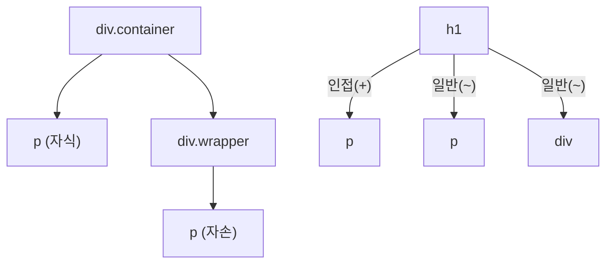

---
tags:
  - css
  - selector
  - pseudo-class
  - pseudo-element
---

# 01. CSS 선택자(Selector)

**선택자(Selector)**는 CSS 규칙의 가장 첫 부분으로, "어떤 HTML 요소에 스타일을 적용할 것인가?"를 정의하는 표현식입니다. 정확하고 효율적인 선택자 사용은 CSS 작성의 핵심 기술입니다. 이 문서에서는 다양한 선택자의 종류와 사용법을 알아봅니다.

#학습목표

- 기본 선택자(전체, 태그, 클래스, ID, 속성)를 사용하여 요소를 선택할 수 있습니다.
- 관계 선택자(자손, 자식, 형제)를 사용하여 요소 간의 구조적 관계를 기반으로 선택할 수 있습니다.
- 가상 클래스와 가상 요소를 사용하여 특정 상태나 위치에 있는 요소를 스타일링할 수 있습니다.

---

## 1. 기본 선택자 (Basic Selectors)

가장 기본이 되는 선택자 유형입니다.

#기본선택자 #basic_selector

| 선택자 유형 | 구문                | 예시               | 설명                                                                             |
| ----------- | ------------------- | ------------------ | -------------------------------------------------------------------------------- |
| **전체**    | `*`                 | `*`                | 페이지 내의 모든 요소를 선택합니다.                                              |
| **태그**    | `tagname`           | `p`, `h1`, `div`   | 해당 태그 이름을 가진 모든 요소를 선택합니다.                                    |
| **클래스**  | `.classname`        | `.alert`, `.card`  | `class` 속성 값이 일치하는 요소를 선택합니다. (재사용 가능)                      |
| **ID**      | `#idname`           | `#header`, `#main` | `id` 속성 값이 일치하는 **고유한** 요소를 선택합니다. (한 페이지에 한 번만 사용) |
| **속성**    | `[attribute=value]` | `[type="text"]`    | 특정 속성 및 값을 가진 요소를 선택합니다.                                        |
| **그룹**    | `A, B`              | `h1, h2, h3`       | 쉼표(`,`)로 여러 선택자를 묶어 동일한 스타일을 적용합니다.                       |

### ID vs Class

- **ID (`#`)**: 문서 전체에서 유일해야 하는 식별자입니다. 주로 페이지의 주요 레이아웃(헤더, 푸터 등)이나 스크립트에서 특정 요소를 참조할 때 사용됩니다. 특이도(Specificity)가 높아 스타일을 덮어쓰기 쉬우므로 신중하게 사용해야 합니다.
- **Class (`.`)**: 여러 요소에 반복적으로 적용할 수 있는 스타일 그룹입니다. 버튼, 카드, 경고창 등 재사용 가능한 컴포넌트를 만들 때 사용하며, 실무에서 가장 기본이 되는 스타일링 단위입니다.

---

## 2. 관계 선택자 (Combinators)

#관계선택자 #combinator

요소 간의 부모-자식 또는 형제 관계를 기반으로 요소를 선택합니다.

| 관계          | 구문    | 예시      | 설명                                                          |
| ------------- | ------- | --------- | ------------------------------------------------------------- |
| **자손**      | `A B`   | `div p`   | `A` 요소의 모든 후손(자식, 손자 등) 중 `B` 요소를 선택합니다. |
| **자식**      | `A > B` | `ul > li` | `A` 요소의 바로 아래 자식인 `B` 요소만 선택합니다.            |
| **인접 형제** | `A + B` | `h1 + p`  | `A` 요소 바로 다음에 오는 형제 `B` 요소 하나만 선택합니다.    |
| **일반 형제** | `A ~ B` | `h1 ~ p`  | `A` 요소 뒤에 오는 모든 형제 `B` 요소를 선택합니다.           |

### 관계도 시각화



- `div.container p`는 `B`와 `D`를 모두 선택합니다.
- `div.container > p`는 `B`만 선택합니다.

---

## 3. 가상 클래스 (Pseudo-classes)

#가상클래스 #pseudo_class

요소의 특정 **상태**나 **구조적 위치**에 따라 스타일을 적용할 때 사용합니다. 콜론(`:`)을 하나 사용합니다.

### 가. 사용자 동작(Interaction) 관련

- `:hover`: 마우스 포인터가 요소 위에 올라가 있을 때.
- `:active`: 사용자가 요소를 클릭하고 있는 동안.
- `:focus`: `input` 요소 등이 포커스를 받았을 때 (탭 키로 이동하거나 클릭했을 때).

### 나. 구조적 위치 관련

- `:first-child`: 형제 요소 중 첫 번째 요소.
- `:last-child`: 형제 요소 중 마지막 요소.
- `:nth-child(n)`: 형제 요소 중 `n`번째 요소.
  - `(2n)`: 짝수 번째 요소.
  - `(2n+1)` 또는 `(odd)`: 홀수 번째 요소.
- `:nth-of-type(n)`: 같은 유형의 형제 요소 중 `n`번째. (`p:nth-of-type(2)`는 두 번째 `p` 태그를 의미)

### 다. 상태 관련

- `:checked`: `input type="checkbox"`나 `radio`가 선택되었을 때.
- `:disabled`: `input`, `button` 등이 비활성화되었을 때.
- `:not(X)`: 선택자 `X`를 제외한 나머지 요소를 선택. (예: `p:not(.fancy)`)

---

## 4. 가상 요소 (Pseudo-elements)

#가상요소 #pseudo_element

요소의 특정 **부분**에만 스타일을 적용하기 위해 사용합니다. CSS3 표준에서는 가상 클래스와의 구분을 위해 더블 콜론(`::`) 사용을 권장합니다.

- `::before`: 요소의 콘텐츠 시작 부분 **앞**에 새로운 콘텐츠나 스타일을 추가합니다. `content` 속성이 필수입니다.
- `::after`: 요소의 콘텐츠 끝 부분 **뒤**에 새로운 콘텐츠나 스타일을 추가합니다. `content` 속성이 필수입니다.
- `::first-line`: 단락 등 블록 요소의 첫 번째 줄에만 스타일을 적용합니다.
- `::first-letter`: 단락 등 블록 요소의 첫 글자에만 스타일을 적용합니다.
- `::marker`: `<li>`와 같은 목록 항목의 마커(불릿, 숫자)에 스타일을 적용합니다.
- `::selection`: 사용자가 드래그하여 선택한 텍스트 영역에 스타일을 적용합니다.

### 실습 예제: `selectors_practice.html`

```html
<!DOCTYPE html>
<html lang="ko">
  <head>
    <title>CSS 선택자 실습</title>
    <style>
      /* 기본 선택자 */
      article {
        font-family: sans-serif;
      }
      .highlight {
        background-color: yellow;
      }
      #main-title {
        color: navy;
      }

      /* 관계 선택자 */
      article > p {
        line-height: 1.8;
      }
      h2 + p {
        font-style: italic;
      }

      /* 가상 클래스 */
      a:hover {
        color: red;
        text-decoration: none;
      }
      ul li:nth-child(odd) {
        color: green;
      }

      /* 가상 요소 */
      p::first-letter {
        font-size: 1.5em;
        font-weight: bold;
      }
      li::marker {
        content: "✅ ";
      }
    </style>
  </head>
  <body>
    <article>
      <h1 id="main-title">선택자란 무엇인가?</h1>
      <p>CSS에서 선택자는 스타일을 적용할 요소를 찾는 패턴입니다.</p>

      <h2>주요 선택자</h2>
      <p class="highlight">이 단락은 하이라이트 클래스를 가집니다.</p>

      <ul>
        <li>첫 번째 항목</li>
        <li>두 번째 항목</li>
        <li>세 번째 항목</li>
      </ul>

      <a href="#">여기에 마우스를 올려보세요</a>
    </article>
  </body>
</html>
```

> **[팁] 선택자 연습 게임**: [CSS Diner](https://flukeout.github.io/) 게임을 통해 다양한 선택자를 재미있게 익힐 수 있습니다.

다음 문서에서는 여러 스타일 규칙이 충돌할 때 어떤 규칙이 최종적으로 적용될지를 결정하는 **캐스케이딩, 상속, 특이도**에 대해 알아봅니다.
