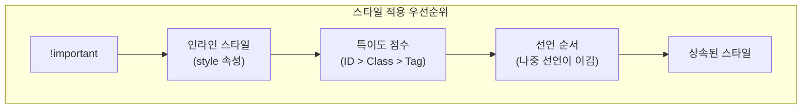

---
tags:
  - css
  - cascade
  - specificity
  - inheritance
---

# 02. 캐스케이딩, 상속, 특이도

하나의 HTML 요소에 여러 CSS 규칙이 동시에 적용될 때, 브라우저는 어떤 스타일을 최종적으로 렌더링할지 결정해야 합니다. 이 과정을 지배하는 세 가지 핵심 원칙이 바로 **캐스케이딩(Cascading)**, **상속(Inheritance)**, **특이도(Specificity)**입니다.

#학습목표

- 스타일 규칙이 충돌할 때 어떤 규칙이 우선되는지 결정하는 캐스케이딩 원칙을 이해합니다.
- 부모 요소의 스타일이 자식 요소에게 전달되는 상속의 개념을 설명할 수 있습니다.
- 선택자의 우선순위를 계산하는 특이도 점수 체계를 이해하고, 이를 통해 스타일 충돌을 예측하고 해결할 수 있습니다.

---

## 1. 캐스케이딩 (Cascading) - 스타일의 폭포수

#캐스케이딩 #cascade #씨에스에스

CSS는 'Cascading Style Sheets'의 약자입니다. 여기서 **캐스케이딩**은 '폭포처럼 위에서 아래로 흐른다'는 의미로, 여러 스타일 규칙이 충돌할 때 최종 적용될 스타일을 결정하는 알고리즘입니다.

캐스케이딩은 다음 세 가지 기준을 순서대로 따릅니다.

1.  **중요도 (Importance)**: `!important` 키워드가 붙은 스타일이 가장 높은 우선순위를 가집니다. 하지만 코드의 예측을 어렵게 하므로 꼭 필요한 경우에만 제한적으로 사용해야 합니다.
2.  **특이도 (Specificity)**: 선택자가 얼마나 구체적인지를 나타내는 점수입니다. 점수가 높은 규칙이 우선됩니다. (아래에서 자세히 설명)
3.  **선언 순서 (Source Order)**: 중요도와 특이도가 모두 같다면, 가장 **나중에 선언된** 규칙이 적용됩니다.

```css
/* 1. p 태그의 색상은 green */
p {
  color: green;
}

/* 2. 나중에 선언되었으므로 green을 덮어쓰고 blue가 됨 */
p {
  color: blue;
}
```

---

## 2. 상속 (Inheritance)

#상속 #inheritance #인헤리턴스

**상속**은 특정 속성이 부모 요소에서 자식 요소로 대물림되는 현상입니다. 모든 속성이 상속되는 것은 아니며, 주로 텍스트 관련 속성들이 상속됩니다.

- **상속되는 속성 예시**: `color`, `font-family`, `font-size`, `font-weight`, `line-height`, `text-align` 등
- **상속되지 않는 속성 예시**: `margin`, `padding`, `border`, `background`, `width`, `height` 등 (박스 모델 관련 속성들)

상속은 불필요한 코드 반복을 줄여줍니다. 예를 들어, `body` 태그에 `font-family`를 한 번만 선언하면 대부분의 자식 요소들이 해당 글꼴을 물려받아 사용하게 됩니다.

```html
<head>
  <style>
    body {
      font-family: "Arial", sans-serif; /* 모든 자식에게 상속됨 */
      border: 1px solid black; /* 자식에게 상속되지 않음 */
    }
    p {
      color: blue; /* body로부터 상속받은 color를 덮어씀 */
    }
  </style>
</head>
<body>
  <div>
    <!-- div는 body로부터 font-family를 상속받음 -->
    <p>이 단락은 p 규칙에 따라 파란색이며, body로부터 글꼴을 상속받습니다.</p>
  </div>
</body>
```

---

## 3. 특이도 (Specificity) - 선택자의 우선순위

#특이도 #specificity #스페시피시티

**특이도**는 선택자가 얼마나 '구체적으로' 요소를 가리키는지를 나타내는 점수입니다. 여러 규칙이 같은 요소를 대상으로 할 때, 브라우저는 특이도 점수가 더 높은 규칙의 스타일을 적용합니다.

### 특이도 점수 계산법

특이도는 보통 `(a, b, c)` 형태의 세 자리 숫자로 표현할 수 있습니다.

|   점수 영역   | 선택자 종류                                     | 예시                                 |
| :-----------: | ----------------------------------------------- | ------------------------------------ |
|  **a (ID)**   | ID 선택자 (`#`)                                 | `#header` (1, 0, 0)                  |
| **b (Class)** | 클래스 (`.`), 속성(`[]`), 가상 클래스(`:hover`) | `.card`, `[type="text"]`, `:checked` |
|  **c (Tag)**  | 태그, 가상 요소(`::before`)                     | `p`, `div`, `::after`                |

- **계산 규칙**:
  1. `a`, `b`, `c` 각 영역의 선택자 개수를 셉니다.
  2. 점수는 단순 합산이 아니라 **자릿수**로 비교합니다. 즉, ID 선택자 1개(`1,0,0`)는 클래스 선택자 100개(`0,100,0`)보다 항상 우선합니다.
  3. 전체 선택자(`*`)와 관계 선택자(`>`, `+`, `~`), `:not()` 등은 특이도 점수에 영향을 주지 않습니다. (단, `:not()` 안의 선택자는 계산에 포함)

### 특이도 예시

| 선택자                 | 계산 (a, b, c) | 특이도 점수 |
| ---------------------- | -------------- | ----------- |
| `p`                    | (0, 0, 1)      | 1           |
| `p.highlight`          | (0, 1, 1)      | 11          |
| `div .highlight`       | (0, 1, 1)      | 11          |
| `div#main p.highlight` | (1, 1, 2)      | 112         |
| `#main p`              | (1, 0, 1)      | 101         |
| `a:hover`              | (0, 1, 1)      | 11          |

**`!important`**: 이 키워드가 붙은 선언은 특이도 점수를 무시하고 최우선 순위를 갖습니다. 하지만 디버깅을 어렵게 만들므로 사용을 자제해야 합니다.

### 시각화



### 스타일 충돌 해결 팁

스타일이 예상대로 적용되지 않을 때, 브라우저의 개발자 도구(F12)를 열어 'Elements' 탭에서 해당 요소를 선택하고 'Styles' 패널을 확인하세요. 어떤 스타일이 적용되었고, 어떤 스타일이 특이도에 의해 무시되었는지(취소선 표시) 직관적으로 파악할 수 있습니다.

다음 문서에서는 CSS의 핵심 속성인 **박스 모델, 글꼴, 색상** 등에 대해 자세히 알아보겠습니다.
