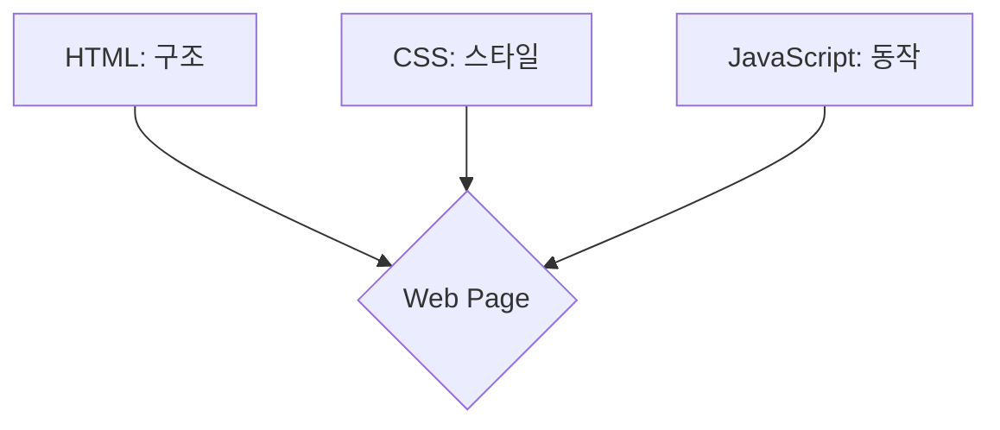

---
tags:
  - javascript
  - web
  - browser
  - nodejs
---

# 00. JavaScript 개요 및 실행 환경

JavaScript(JS)는 웹 페이지에 생동감을 불어넣기 위해 만들어진 **객체 기반의 스크립트 프로그래밍 언어**입니다. 처음에는 브라우저에서 간단한 상호작용을 처리하는 용도로 시작했지만, 오늘날에는 프론트엔드(웹 클라이언트), 백엔드(서버), 모바일 앱, 데스크톱 앱 등 거의 모든 영역에서 사용되는 핵심 언어로 발전했습니다.

#학습목표

- JavaScript가 무엇이며 웹에서 어떤 역할을 하는지 설명할 수 있습니다.
- 브라우저 개발자 도구의 콘솔을 통해 JavaScript 코드를 실행할 수 있습니다.
- HTML 파일에 `<script>` 태그를 사용하여 JavaScript 코드를 포함하는 두 가지 방법(내부 작성, 외부 파일 로드)을 이해합니다.
- Node.js가 무엇이며 브라우저 환경과의 차이점을 간략히 이해합니다.

---

## 1. JavaScript란?

- **인터프리터 언어**: 컴파일 과정 없이 코드를 한 줄씩 읽어 바로 실행하는 스크립트 언어입니다. 이 덕분에 개발 속도가 빠릅니다.
- **동적 타입 언어**: 변수를 선언할 때 타입을 명시할 필요가 없으며, 실행 중에 타입이 결정됩니다. 유연하지만 예기치 않은 타입 관련 오류가 발생할 수 있습니다.
- **객체 기반**: JavaScript의 거의 모든 것은 객체(Object)로 이루어져 있습니다.
- **웹의 3요소**: HTML이 웹 페이지의 '구조'를, CSS가 '스타일'을 담당한다면, JavaScript는 '동작'을 담당합니다. 사용자의 클릭, 스크롤, 입력 등에 반응하여 콘텐츠를 동적으로 변경하고 서버와 통신하는 역할을 합니다.



---

## 2. JavaScript 실행 환경

JavaScript 코드를 실행하는 환경은 크게 **브라우저(Browser)**와 **Node.js**로 나뉩니다.

### 1) 브라우저 환경

모든 최신 웹 브라우저(Chrome, Firefox, Safari, Edge 등)는 JavaScript 엔진을 내장하고 있어 코드를 해석하고 실행할 수 있습니다.

#### 브라우저에서 JS 코드 실행 방법

**A. 개발자 도구 콘솔 (Developer Tools Console)**

- 가장 간단하게 코드를 테스트하는 방법입니다.
- 브라우저에서 `F12` 또는 `Ctrl+Shift+I` (macOS: `Cmd+Opt+I`) 키를 눌러 개발자 도구를 열고, 'Console' 탭에서 코드를 직접 입력하고 실행할 수 있습니다.
- 예: `console.log("Hello, World!");` 입력 후 Enter

**B. `<script>` 태그 사용**
HTML 문서 내에 JavaScript 코드를 포함시키는 방법입니다.

- **내부 스크립트**: `<script>` 태그 안에 코드를 직접 작성합니다. 간단한 코드에 적합합니다.

  ```html
  <!DOCTYPE html>
  <html>
    <head>
      <title>JS 실습</title>
    </head>
    <body>
      <h1>안녕하세요!</h1>
      <script>
        // script 태그 안에 직접 코드 작성
        console.log("HTML 문서 안에서 실행!");
        alert("이것은 alert 창입니다.");
      </script>
    </body>
  </html>
  ```

  _`<script>` 태그는 `<body>` 태그가 끝나기 직전에 위치하는 것이 좋습니다. HTML 요소들이 모두 렌더링된 후에 스크립트가 실행되어야 DOM 조작 시 오류가 발생하지 않기 때문입니다._

- **외부 스크립트**: `.js` 확장자를 가진 별도의 파일에 코드를 작성하고, `<script>` 태그의 `src` 속성으로 불러옵니다. 코드가 길어지거나 여러 페이지에서 재사용될 때 권장되는 방식입니다.
  **`my-script.js`**
  ```javascript
  console.log("외부 JS 파일에서 실행!");
  ```
  **`index.html`**
  ```html
  <!DOCTYPE html>
  <html>
    <body>
      <!-- src 속성으로 외부 파일 연결 -->
      <script src="my-script.js"></script>
    </body>
  </html>
  ```

### 2) Node.js 환경

#nodejs

Node.js는 브라우저 밖, 즉 **서버 환경**에서 JavaScript를 실행할 수 있게 해주는 런타임 환경입니다. Node.js의 등장으로 JavaScript는 프론트엔드뿐만 아니라 백엔드 개발에서도 널리 사용되게 되었습니다.

- **차이점**: 브라우저 환경에서는 `window` 객체와 DOM(Document Object Model) API를 사용하여 웹 페이지를 조작하는 것이 주 목적이지만, Node.js 환경에서는 파일 시스템 접근, 데이터베이스 연동, 네트워크 통신 등 서버 측 기능을 수행하는 것이 주 목적입니다. 따라서 Node.js에는 `document`나 `alert` 같은 브라우저 전용 기능이 없습니다.

이 문서에서는 주로 브라우저 환경을 기준으로 JavaScript 기초를 다룹니다.
