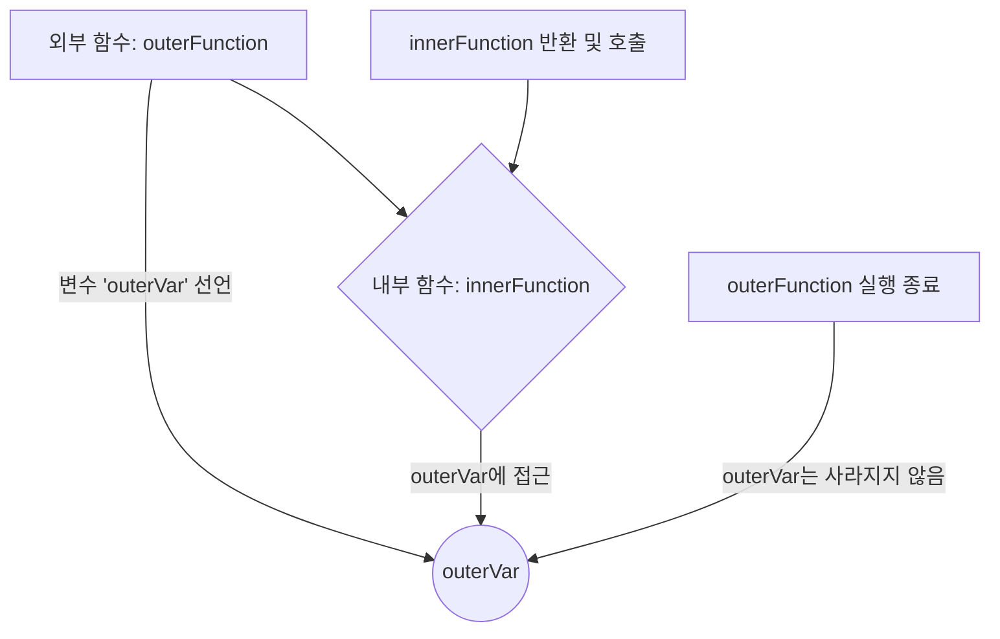

# 03. 함수와 스코프

#함수 #function #펑션 #스코프 #scope #스코프

JavaScript에서 함수는 코드의 재사용성을 높이고 프로그램을 모듈화하는 데 핵심적인 역할을 합니다. 스코프는 변수가 어디까지 유효한지를 결정하는 중요한 개념입니다.

---

## 1. 함수 (Function)

함수는 특정 작업을 수행하는 코드 블록입니다. 입력을 받아 처리한 후 출력을 반환할 수 있습니다.

### 가. 함수 선언문 (Function Declaration)

`function` 키워드를 사용하여 함수를 정의하는 가장 일반적인 방법입니다.

```javascript
// 함수 선언
function add(x, y) {
  return x + y;
}

// 함수 호출
let result = add(10, 20);
console.log(result); // 30
```

- **호이스팅(Hoisting)**: 함수 선언문으로 정의된 함수는 코드 실행 전에 메모리에 먼저 등록되므로, 함수가 선언된 위치보다 앞에서 호출할 수 있습니다.

```javascript
console.log(add(5, 3)); // 8 (오류 없이 실행됨)

function add(x, y) {
  return x + y;
}
```

### 나. 함수 표현식 (Function Expression)

함수를 변수에 할당하는 방식입니다. 익명 함수(이름 없는 함수)를 사용하는 경우가 많습니다.

```javascript
const subtract = function (x, y) {
  return x - y;
};

console.log(subtract(10, 3)); // 7
```

- **호이스팅(Hoisting)**: 함수 표현식은 변수 선언과 동일하게 취급됩니다. `var`로 선언하면 변수 선언부만 호이스팅되고 `undefined`가 할당되며, `let`이나 `const`로 선언하면 호이스팅은 되지만 초기화되지 않아 TDZ(Temporal Dead Zone)에 빠져 오류가 발생합니다. 따라서 함수 표현식은 선언된 이후에만 호출할 수 있습니다.

```javascript
// console.log(subtract(10, 3)); // ReferenceError: Cannot access 'subtract' before initialization

const subtract = function (x, y) {
  return x - y;
};
```

### 다. 화살표 함수 (Arrow Function)

ES6에서 도입된 문법으로, 함수를 더 간결하게 표현할 수 있습니다.

```javascript
// 기본 형태
const multiply = (x, y) => {
  return x * y;
};

// 코드가 한 줄이면 중괄호와 return 생략 가능
const divide = (x, y) => x / y;

// 매개변수가 하나면 괄호 생략 가능
const square = (x) => x * x;

console.log(multiply(2, 5)); // 10
console.log(divide(10, 2)); // 5
console.log(square(4)); // 16
```

**화살표 함수의 특징:**

1.  **간결한 문법**: 코드를 줄여 가독성을 높일 수 있습니다.
2.  **`this` 바인딩**: 화살표 함수는 자신만의 `this`를 갖지 않습니다. 대신, 자신을 감싸고 있는 상위 스코프의 `this`를 그대로 물려받습니다. 이 특징은 콜백 함수에서 `this` 컨텍스트를 유지해야 할 때 매우 유용합니다.

---

## 2. 스코프 (Scope)

#스코프 #scope #스코프

스코프는 "범위"를 의미하며, 변수나 함수에 접근할 수 있는 영역을 결정합니다.

### 가. 전역 스코프 (Global Scope)

코드의 가장 바깥 영역에서 선언된 변수는 전역 스코프를 가집니다. 이 변수들은 코드 어디에서든 접근할 수 있습니다.

```javascript
const globalVar = "I am global";

function printVar() {
  console.log(globalVar); // "I am global"
}

printVar();
console.log(globalVar); // "I am global"
```

### 나. 함수 스코프 (Function Scope)

함수 내부에서 선언된 변수는 해당 함수 내에서만 접근할 수 있습니다. `var` 키워드로 선언된 변수가 함수 스코프를 따릅니다.

```javascript
function myFunction() {
  var functionScopedVar = "I am in a function";
  console.log(functionScopedVar);
}

myFunction(); // "I am in a function"
// console.log(functionScopedVar); // ReferenceError: functionScopedVar is not defined
```

### 다. 블록 스코프 (Block Scope)

`{}` (중괄호)로 둘러싸인 코드 블록(`if`, `for`, `while` 등) 내에서 선언된 변수는 해당 블록 내에서만 유효합니다. ES6에서 도입된 `let`과 `const` 키워드로 선언된 변수가 블록 스코프를 따릅니다.

```javascript
if (true) {
  let blockScopedVar = "I am in a block";
  const alsoBlockScoped = "Me too";
  console.log(blockScopedVar); // "I am in a block"
}

// console.log(blockScopedVar); // ReferenceError: blockScopedVar is not defined
```

`var`는 블록 스코프를 무시하므로 예기치 않은 문제를 일으킬 수 있어 `let`과 `const` 사용이 권장됩니다.

```javascript
for (var i = 0; i < 3; i++) {
  console.log(i); // 0, 1, 2
}
console.log(i); // 3 (블록 밖에서도 접근 가능)

for (let j = 0; j < 3; j++) {
  console.log(j); // 0, 1, 2
}
// console.log(j); // ReferenceError: j is not defined
```

---

## 3. 클로저 (Closure)

#클로저 #closure #클로저

클로저는 함수와 그 함수가 선언될 당시의 렉시컬 환경(Lexical Environment)의 조합입니다. 간단히 말해, **외부 함수의 실행이 끝나더라도 내부 함수가 외부 함수의 변수에 접근할 수 있는 현상**을 의미합니다.



### 클로저 예제

```javascript
function outerFunction() {
  const outerVar = "I am from the outer function";

  // innerFunction은 outerFunction의 스코프에 접근할 수 있다.
  function innerFunction() {
    console.log(outerVar);
  }

  return innerFunction;
}

// outerFunction의 실행이 끝나고 innerFunc 변수에 innerFunction이 할당됨
const innerFunc = outerFunction();

// outerFunction의 생명주기는 끝났지만, innerFunc를 통해 outerVar에 접근 가능
innerFunc(); // "I am from the outer function"
```

이 예제에서 `innerFunction`은 자신이 생성될 때의 환경(렉시컬 스코프)을 기억합니다. 이 환경에는 `outerVar`가 포함되어 있습니다. `outerFunction`의 실행이 끝난 후에도 `innerFunc`를 통해 `outerVar`에 접근할 수 있는 이유가 바로 클로저 때문입니다.

클로저는 데이터 은닉(private 변수 흉내), 상태 유지 등 고급 프로그래밍 패턴에 유용하게 사용됩니다.
