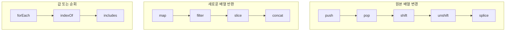

# 04. 객체와 배열

#객체 #object #오브젝트 #배열 #array #어레이

객체(Object)와 배열(Array)은 JavaScript에서 가장 중요한 데이터 구조입니다. 객체는 이름(key)과 값(value)으로 구성된 속성의 집합이며, 배열은 순서가 있는 값의 목록입니다.

---

## 1. 객체 (Object)

객체는 관련된 데이터와 기능을 하나로 묶는 데 사용됩니다.

### 가. 객체 리터럴 (Object Literal)

중괄호 `{}`를 사용하여 객체를 생성하는 가장 간단한 방법입니다.

```javascript
// 'person'이라는 이름의 객체 생성
const person = {
  // 속성(Property): key와 value로 구성
  name: "홍길동",
  age: 30,
  isStudent: false,

  // 메서드(Method): 객체에 속한 함수
  sayHello: function () {
    // this는 현재 객체(person)를 가리킴
    console.log(`안녕하세요, 제 이름은 ${this.name}입니다.`);
  },
};

// 속성 접근
console.log(person.name); // "홍길동" (점 표기법)
console.log(person["age"]); // 30 (대괄호 표기법)

// 메서드 호출
person.sayHello(); // "안녕하세요, 제 이름은 홍길동입니다."
```

- **점 표기법 (`.`)**: 키가 유효한 식별자일 때 사용합니다. 일반적으로 이 방법을 선호합니다.
- **대괄호 표기법 (`[]`)**: 키가 변수이거나, 공백이나 특수문자를 포함할 때 사용합니다. 키는 문자열로 전달해야 합니다.

### 나. 객체 속성 추가 및 삭제

```javascript
const person = { name: "Alice" };

// 속성 추가
person.age = 25;
person["job"] = "Developer";

console.log(person); // { name: 'Alice', age: 25, job: 'Developer' }

// 속성 삭제
delete person.age;
console.log(person); // { name: 'Alice', job: 'Developer' }
```

---

## 2. 배열 (Array)

배열은 여러 개의 값을 하나의 변수에 순서대로 저장하기 위해 사용됩니다.

### 가. 배열 리터럴 (Array Literal)

대괄호 `[]`를 사용하여 배열을 생성합니다.

```javascript
// 'fruits'라는 이름의 배열 생성
const fruits = ["사과", "바나나", "딸기"];

// 배열 요소 접근 (인덱스는 0부터 시작)
console.log(fruits[0]); // "사과"
console.log(fruits[1]); // "바나나"

// 배열의 길이
console.log(fruits.length); // 3

// 배열 요소 변경
fruits[1] = "포도";
console.log(fruits); // ["사과", "포도", "딸기"]
```

배열에는 어떤 데이터 타입이든 포함할 수 있습니다.

```javascript
const mixedArray = [1, "hello", true, { name: "객체" }, [1, 2]];
```

### 나. 자주 사용하는 배열 메서드

#배열메서드 #array-methods

배열을 다룰 때 유용한 내장 메서드들이 많이 있습니다.



| 메서드                 | 설명                                                               | 원본 배열 변경 |
| ---------------------- | ------------------------------------------------------------------ | :------------: |
| `push(item)`           | 배열의 끝에 요소를 추가합니다.                                     |       O        |
| `pop()`                | 배열의 마지막 요소를 제거하고 반환합니다.                          |       O        |
| `unshift(item)`        | 배열의 앞에 요소를 추가합니다.                                     |       O        |
| `shift()`              | 배열의 첫 번째 요소를 제거하고 반환합니다.                         |       O        |
| `splice(start, count)` | 특정 인덱스에서 요소를 제거하거나 추가합니다.                      |       O        |
| `forEach(callback)`    | 각 요소에 대해 주어진 함수를 실행합니다.                           |       X        |
| `map(callback)`        | 각 요소에 대해 함수를 실행하고, 그 결과로 새 배열을 생성합니다.    |       X        |
| `filter(callback)`     | 주어진 함수의 조건을 만족하는 요소만 모아 새 배열을 생성합니다.    |       X        |
| `indexOf(item)`        | 지정된 요소의 첫 번째 인덱스를 반환합니다. 없으면 -1을 반환합니다. |       X        |
| `includes(item)`       | 배열이 특정 요소를 포함하고 있는지 확인합니다. (true/false)        |       X        |

#### 예제 코드

```javascript
const numbers = [10, 20, 30, 40];

// forEach: 각 요소를 출력
numbers.forEach(function (num) {
  console.log(num);
});

// map: 각 요소를 2배로 만든 새 배열 생성
const doubled = numbers.map(function (num) {
  return num * 2;
});
console.log(doubled); // [20, 40, 60, 80]

// filter: 25보다 큰 요소만 필터링한 새 배열 생성
const filtered = numbers.filter(function (num) {
  return num > 25;
});
console.log(filtered); // [30, 40]

// push: 끝에 요소 추가
numbers.push(50);
console.log(numbers); // [10, 20, 30, 40, 50]

// pop: 마지막 요소 제거
const last = numbers.pop();
console.log(last); // 50
console.log(numbers); // [10, 20, 30, 40]
```
