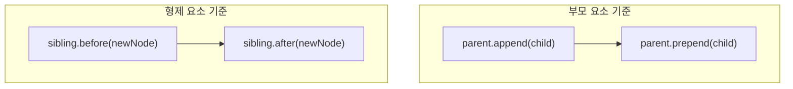

# 02. DOM 노드 생성과 관리

#dom #노드생성 #노드관리 #node-creation #node-management

JavaScript의 가장 강력한 기능 중 하나는 HTML 요소를 동적으로 생성하여 페이지에 추가하거나 기존 요소를 제거하는 것입니다. 이를 통해 사용자와의 상호작용에 따라 실시간으로 변하는 웹 페이지를 구현할 수 있습니다.

---

## 1. 새로운 노드 생성: `document.createElement()`

`document.createElement('tagName')` 메서드는 지정된 태그 이름의 새로운 HTML 요소 노드를 메모리에 생성합니다. 이 단계에서는 아직 화면에 보이지 않습니다.

```javascript
// 'p' 태그와 'button' 태그 요소를 생성
const newParagraph = document.createElement("p");
const newButton = document.createElement("button");

// 생성된 요소의 내용을 설정
newParagraph.textContent = "새롭게 추가된 문단입니다.";
newButton.textContent = "클릭";

console.log(newParagraph); // <p>새롭게 추가된 문단입니다.</p> (메모리 상에만 존재)
```

---

## 2. 노드 삽입 및 재배치

생성된 노드를 문서에 추가하거나 기존 노드의 위치를 옮기는 다양한 메서드가 있습니다.



| 메서드                    | 설명                                                                                         |
| :------------------------ | :------------------------------------------------------------------------------------------- |
| `parent.append(child)`    | `parent` 요소의 **마지막 자식**으로 `child` 노드를 추가합니다. 문자열도 추가할 수 있습니다.  |
| `parent.prepend(child)`   | `parent` 요소의 **첫 번째 자식**으로 `child` 노드를 추가합니다. 문자열도 추가할 수 있습니다. |
| `sibling.before(newNode)` | `sibling` 요소의 **바로 앞**에 `newNode`를 형제 요소로 추가합니다.                           |
| `sibling.after(newNode)`  | `sibling` 요소의 **바로 뒤**에 `newNode`를 형제 요소로 추가합니다.                           |

### 예제 코드

```html
<!-- index.html -->
<div id="container">
  <p id="p1">첫 번째 문단</p>
</div>
```

```javascript
// app.js
const container = document.getElementById("container");
const p1 = document.getElementById("p1");

const newP = document.createElement("p");
newP.textContent = "새로운 문단";

// 1. 마지막 자식으로 추가
container.append(newP);
// 결과: <div id="container"><p id="p1">...</p><p>새로운 문단</p></div>

// 2. 첫 번째 자식으로 추가
const firstP = document.createElement("p");
firstP.textContent = "가장 처음 문단";
container.prepend(firstP);
// 결과: <div id="container"><p>가장 처음 문단</p><p id="p1">...</p><p>...</p></div>

// 3. 특정 요소 앞으로 추가
const beforeP = document.createElement("p");
beforeP.textContent = "p1 앞 문단";
p1.before(beforeP);
// 결과: ...<p>가장 처음 문단</p><p>p1 앞 문단</p><p id="p1">...</p>...
```

---

## 3. 노드 삭제 및 복제

- `element.remove()`: 해당 요소를 DOM 트리에서 완전히 제거합니다.
- `element.cloneNode(deep)`: 해당 요소를 복제합니다.
  - `deep` 인자가 `true`이면, 자식 노드까지 모두 포함하여 깊은 복사를 수행합니다.
  - `deep` 인자가 `false`이거나 생략되면, 해당 요소 자체만 얕은 복사를 수행합니다.

```javascript
// p1 요소 삭제
p1.remove();

// newP 요소 깊은 복제
const clonedP = newP.cloneNode(true);
container.append(clonedP); // 복제된 노드를 컨테이너 끝에 추가
```

---

## 4. 효율적인 대량 삽입: `DocumentFragment`

#documentfragment #성능최적화

여러 개의 요소를 반복문으로 생성하여 DOM에 추가할 때, 매번 `append()`를 호출하면 렌더링이 반복적으로 발생하여 성능이 저하될 수 있습니다.

`document.createDocumentFragment()`는 이러한 문제를 해결하기 위한 가상의 '문서 조각'입니다. 메모리 상에만 존재하는 경량 컨테이너로, 여기에 모든 노드를 추가한 뒤 최종적으로 실제 DOM에 한 번만 삽입하면 됩니다. 이 방식은 단 한 번의 리플로우(reflow)와 리페인트(repaint)만 발생시켜 성능을 크게 향상시킵니다.

```javascript
const list = document.querySelector("#item-list");

// 1. DocumentFragment 생성
const fragment = document.createDocumentFragment();

for (let i = 0; i < 1000; i++) {
  const li = document.createElement("li");
  li.textContent = `아이템 ${i + 1}`;

  // 2. 실제 DOM이 아닌 fragment에 li를 추가
  fragment.append(li);
}

// 3. 완성된 fragment를 실제 DOM에 단 한 번만 삽입
list.append(fragment); // 렌더링이 한 번만 발생
```
