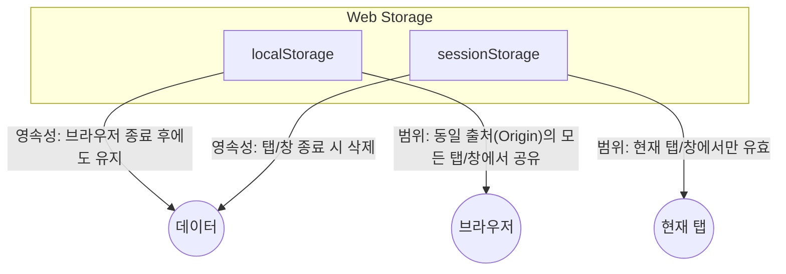

# 03. BOM과 웹 스토리지

#bom #browser-object-model #봄 #웹스토리지 #web-storage #로컬스토리지 #세션스토리지

BOM(Browser Object Model)은 웹 페이지의 내용(`document`)을 제외한 브라우저의 창, 탭, URL, 화면 정보 등을 제어하는 API 집합입니다. 이 중 웹 스토리지(Web Storage)는 브라우저에 데이터를 저장하는 중요한 기능을 제공합니다.

---

## 1. BOM (Browser Object Model)

BOM의 최상위 객체는 `window`이며, 이는 JavaScript의 전역 객체이기도 합니다. `window` 객체를 통해 브라우저의 다양한 기능에 접근할 수 있습니다.

- **`location`**: 현재 페이지의 URL 정보를 담고 있으며, URL을 변경하여 페이지를 이동시킬 수 있습니다.
  - `location.href`: 전체 URL 주소
  - `location.reload()`: 현재 페이지 새로고침
- **`history`**: 브라우저의 방문 기록을 제어합니다.
  - `history.back()`: 뒤로 가기
  - `history.forward()`: 앞으로 가기
  - `history.pushState(state, title, url)`: 페이지를 새로고침하지 않고 URL을 변경하고 방문 기록을 추가합니다. (SPA 라우팅의 핵심)
- **`navigator`**: 브라우저의 종류, 버전, 언어, 위치 정보 등을 담고 있습니다.
- **`window.open()`**: 새 탭이나 팝업 창을 엽니다.

```javascript
// 현재 URL 확인 및 페이지 이동
console.log(location.href);
// location.href = 'https://www.google.com'; // 구글로 이동

// 방문 기록 제어
history.pushState({}, "새로운 페이지", "/dashboard"); // URL만 변경

// 새 창 열기
const popup = window.open("about:blank", "sub", "width=500,height=500");
```

---

## 2. 웹 스토리지 (Web Storage)

#웹스토리지 #web-storage

웹 스토리지는 사용자의 브라우저에 **Key-Value 형태의 문자열 데이터**를 저장할 수 있는 API입니다. 쿠키(Cookie)에 비해 더 큰 용량을 제공하며, 서버로 매번 전송되지 않아 더 효율적입니다. `localStorage`와 `sessionStorage` 두 종류가 있습니다.



### 비교표

| 구분          | `localStorage`                                      | `sessionStorage`                                  |
| :------------ | :-------------------------------------------------- | :------------------------------------------------ |
| **영속성**    | **영구적** (사용자가 직접 삭제하지 않는 한 유지)    | **세션 단위** (탭 또는 브라우저 창을 닫으면 삭제) |
| **범위**      | 동일 출처(Origin)의 모든 탭/창에서 **공유**         | 동일 출처 내에서도 각 탭/창마다 **독립적**        |
| **용량**      | 약 5MB ~ 10MB                                       | 약 5MB ~ 10MB                                     |
| **주요 용도** | 자동 로그인 정보, 테마 설정 등 지속되어야 할 데이터 | 일회성 정보, 입력 폼의 임시 데이터 등             |

### API 사용법

`localStorage`와 `sessionStorage`는 동일한 API를 가집니다.

- `setItem(key, value)`: 데이터 저장
- `getItem(key)`: 데이터 조회
- `removeItem(key)`: 특정 데이터 삭제
- `clear()`: 모든 데이터 삭제

**주의**: 웹 스토리지는 문자열(String) 데이터만 저장할 수 있습니다. 객체나 배열을 저장하려면 `JSON.stringify()`로 직렬화하고, 다시 가져올 때는 `JSON.parse()`로 역직렬화해야 합니다.

```javascript
// --- localStorage 예제 ---
// 사용자 테마 설정 저장
localStorage.setItem("theme", "dark");

// 저장된 테마 불러오기
const currentTheme = localStorage.getItem("theme"); // 'dark'
console.log(currentTheme);

// --- sessionStorage 예제 ---
// 객체 데이터를 JSON 문자열로 변환하여 저장
const draftPost = { title: "임시 글", content: "내용..." };
sessionStorage.setItem("draft", JSON.stringify(draftPost));

// 저장된 문자열을 다시 객체로 변환하여 사용
const savedDraft = JSON.parse(sessionStorage.getItem("draft"));
console.log(savedDraft.title); // '임시 글'
```

### `storage` 이벤트

한 탭에서 `localStorage`의 값이 변경되면, 동일한 출처의 다른 탭들에서 `storage` 이벤트가 발생합니다. 이를 이용해 여러 탭 간의 상태를 동기화할 수 있습니다.

```javascript
// 다른 탭에서 localStorage.setItem('theme', 'light')를 실행하면 이 이벤트가 발생
window.addEventListener("storage", (e) => {
  if (e.key === "theme") {
    console.log(`테마가 ${e.newValue}(으)로 변경되었습니다.`);
    // 여기서 화면 테마를 변경하는 함수를 호출할 수 있음
  }
});
```
