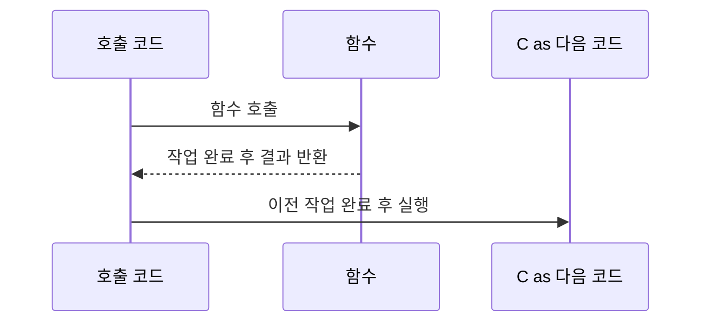
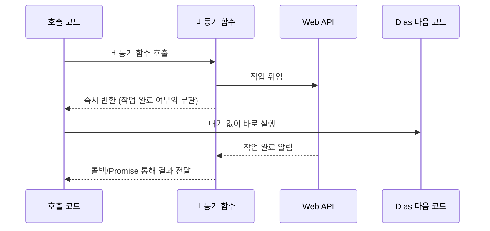
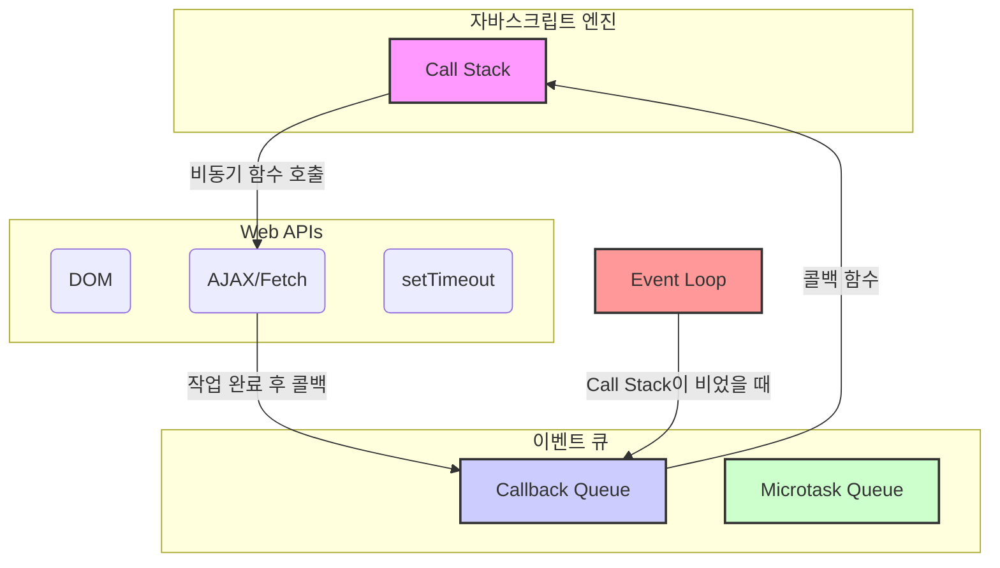

# 00. 비동기 처리와 이벤트 루프

#비동기 #asynchronous #어싱크러너스 #이벤트루프 #eventloop #이벤트루프

자바스크립트는 싱글 스레드(Single Thread) 기반 언어이지만, 비동기(Asynchronous) 처리를 통해 동시성(Concurrency)을 확보합니다. 이 문서에서는 동기와 비동기의 차이, 그리고 자바스크립트의 비동기 모델의 핵심인 이벤트 루프(Event Loop)에 대해 알아봅니다.

---

## 1. 동기(Synchronous) vs 비동기(Asynchronous)

### 가. 동기 처리

- **정의**: 코드가 작성된 순서대로 위에서 아래로, 하나씩 차례대로 실행되는 방식입니다. 하나의 작업이 완전히 끝나야만 다음 작업이 시작될 수 있습니다.
- **장점**: 코드의 실행 순서가 직관적이고 이해하기 쉽습니다.
- **단점**: 오래 걸리는 작업(예: 네트워크 요청, 대용량 파일 읽기)이 발생하면, 해당 작업이 끝날 때까지 프로그램 전체가 멈추는 **UI 블로킹(UI Blocking)** 현상이 발생하여 사용자 경험을 해칠 수 있습니다.



**코드 예시:**

```javascript
// 동기 코드 예시
console.log("--- 동기 코드 시작 ---");

console.log("1. 첫 번째 작업");
console.log("2. 두 번째 작업");
console.log("3. 세 번째 작업");

console.log("--- 동기 코드 종료 ---");

/*
예상 출력 순서:
--- 동기 코드 시작 ---
1. 첫 번째 작업
2. 두 번째 작업
3. 세 번째 작업
--- 동기 코드 종료 ---
*/
```

### 나. 비동기 처리

- **정의**: 작업이 끝나는 것을 기다리지 않고 다음 코드를 바로 실행하는 방식입니다. 오래 걸리는 작업은 백그라운드(Web API)에 위임하고, 그 작업이 완료되면 결과를 받아 처리합니다.
- **장점**: 프로그램이 멈추지 않아 쾌적한 사용자 경험을 제공할 수 있습니다.
- **단점**: 코드의 실행 순서가 복잡해질 수 있어, 콜백(Callback), 프로미스(Promise), async/await 등 비동기 처리 패턴에 대한 이해가 필요합니다.



**코드 예시:**

```javascript
// 비동기 코드 예시
console.log("--- 비동기 코드 시작 ---");
console.log("A. 첫 번째 작업");

// setTimeout은 대표적인 비동기 함수입니다.
// 브라우저에게 "1.5초 뒤에 이 함수를 실행해줘"라고 '예약'만 하고,
// 결과를 기다리지 않고 즉시 다음 코드로 넘어갑니다.
setTimeout(() => {
  // 이 코드는 1.5초 뒤에 실행됩니다.
  console.log("B. 두 번째 작업 (1.5초 후 실행됨)");
}, 1500);

// setTimeout은 기다려주지 않으므로, 이 코드가 먼저 실행됩니다.
console.log("C. 세 번째 작업");
console.log("--- 비동기 코드 종료 ---");

/*
예상 출력 순서:
--- 비동기 코드 시작 ---
A. 첫 번째 작업
C. 세 번째 작업
--- 비동기 코드 종료 ---
B. 두 번째 작업 (1.5초 후 실행됨)
*/
```

---

## 2. 자바스크립트 엔진과 이벤트 루프

자바스크립트 엔진 자체는 싱글 스레드이지만, 브라우저나 Node.js 환경에서 제공하는 **Web API**와 **이벤트 루프** 덕분에 비동기 작업이 가능합니다.



1.  **Call Stack (호출 스택)**

    - 자바스크립트 코드 실행을 담당하는 곳으로, 함수 호출이 쌓이는 스택(LIFO) 구조입니다.
    - 동기 코드는 Call Stack에 순서대로 쌓이고 실행됩니다.

2.  **Web API**

    - 브라우저가 제공하는 API로, `setTimeout`, `fetch`, DOM 이벤트 등 비동기 작업을 처리합니다.
    - Call Stack에서 비동기 함수가 호출되면, Web API가 해당 작업을 넘겨받아 백그라운드에서 처리합니다.

3.  **Callback Queue (Task Queue)**

    - Web API에서 처리 완료된 비동기 작업의 콜백 함수가 대기하는 큐(FIFO)입니다.
    - `setTimeout`, `setInterval`, DOM 이벤트 핸들러 등의 콜백이 여기에 들어갑니다.

4.  **Microtask Queue**

    - `Promise`, `async/await`, `queueMicrotask` 등의 콜백이 대기하는 큐입니다.
    - **Callback Queue보다 우선순위가 높습니다.**

5.  **Event Loop (이벤트 루프)**
    - Call Stack과 Callback/Microtask Queue를 지속적으로 감시하는 역할을 합니다.
    - **Call Stack이 비어 있을 때**, Microtask Queue에 있는 모든 작업을 먼저 Call Stack으로 옮겨 실행합니다.
    - Microtask Queue가 비워지면, Callback Queue에서 가장 오래된 작업을 하나 Call Stack으로 옮겨 실행합니다. 이 과정을 계속 반복합니다.

이러한 구조 덕분에 자바스크립트는 하나의 스레드로도 여러 작업을 효율적으로 처리하며 블로킹을 방지할 수 있습니다.
