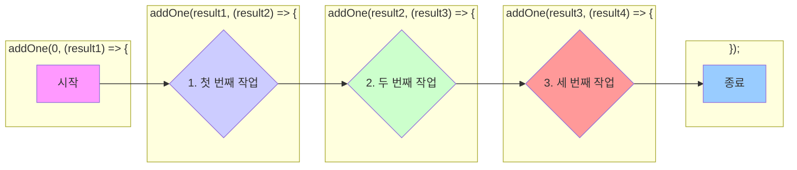

# 01. 콜백 패턴과 콜백 지옥

#콜백 #callback #콜백 #콜백지옥 #callbackhell #콜백헬

비동기 프로그래밍의 가장 기본적인 패턴은 콜백(Callback) 함수를 사용하는 것입니다. 이 문서에서는 콜백 함수의 개념과 한계점인 '콜백 지옥'에 대해 알아봅니다.

---

## 1. 콜백 함수 (Callback Function)

- **정의**: 다른 함수의 인자(argument)로 전달되어, 특정 시점(주로 비동기 작업이 끝난 후)에 실행되는 함수입니다. "나중에 호출해 줘(Call me back)"라는 의미를 가집니다.
- **용도**: 비동기 작업이 완료되었을 때 그 결과를 처리하거나, 특정 이벤트가 발생했을 때 원하는 동작을 수행하기 위해 사용됩니다.

**기본적인 콜백 패턴:**

```javascript
// 작업을 수행할 함수. 마지막 인자로 콜백 함수를 받습니다.
function performTask(data, callback) {
  console.log(`'${data}'(으)로 작업을 시작합니다...`);

  // 비동기 작업을 시뮬레이션하기 위해 setTimeout 사용
  setTimeout(() => {
    const result = `${data} 작업 완료!`;
    // 작업이 끝나면, 인자로 받은 콜백 함수를 실행하며 결과를 전달합니다.
    callback(result);
  }, 1000);
}

// 콜백으로 전달할 함수. 작업 결과를 받아 출력합니다.
function handleResult(result) {
  console.log("콜백 함수 실행됨:", result);
}

// 함수 호출: performTask가 끝나면 handleResult를 실행해달라는 의미
performTask("중요한 데이터", handleResult);

console.log(
  "performTask 함수 호출 이후 코드. 콜백을 기다리지 않고 바로 실행됩니다."
);

/*
예상 출력:
'중요한 데이터'(으)로 작업을 시작합니다...
performTask 함수 호출 이후 코드. 콜백을 기다리지 않고 바로 실행됩니다.
(1초 후)
콜백 함수 실행됨: 중요한 데이터 작업 완료!
*/
```

---

## 2. 콜백 지옥 (Callback Hell)

- **정의**: 비동기 작업을 순차적으로 처리하기 위해 콜백 함수를 계속해서 중첩하여 사용하는 코드 구조를 말합니다. 코드가 깊게 들여쓰기 되어 피라미드 형태(Pyramid of Doom)를 띠게 됩니다.
- **문제점**:
  1.  **가독성 저하**: 코드의 흐름을 파악하기 매우 어렵습니다.
  2.  **에러 처리의 어려움**: 각 콜백 단계마다 에러를 개별적으로 처리해야 해서 복잡하고 누락하기 쉽습니다.
  3.  **유지보수의 어려움**: 코드 수정이나 디버깅이 매우 힘들어집니다.

**콜백 지옥 예시 코드:**

비동기적으로 1초마다 숫자를 1씩 더해가는 작업을 콜백으로 구현한 예시입니다.

```javascript
// 콜백 지옥 예시
function addOne(value, callback) {
  setTimeout(() => {
    const result = value + 1;
    console.log(`현재 값: ${value}, 1 더한 결과: ${result}`);
    callback(result);
  }, 1000);
}

// 콜백이 계속 중첩되는 '콜백 지옥'
addOne(0, (result1) => {
  addOne(result1, (result2) => {
    addOne(result2, (result3) => {
      addOne(result3, (result4) => {
        console.log("최종 결과:", result4);
        // 만약 여기서 또 다른 비동기 작업이 필요하다면...
        // 들여쓰기는 계속 깊어집니다.
      });
    });
  });
});
```



이러한 콜백 지옥의 문제점을 해결하기 위해 ES6부터 **프로미스(Promise)**가 도입되었고, 이후 **async/await** 문법이 등장하면서 비동기 코드를 훨씬 깔끔하게 작성할 수 있게 되었습니다.
