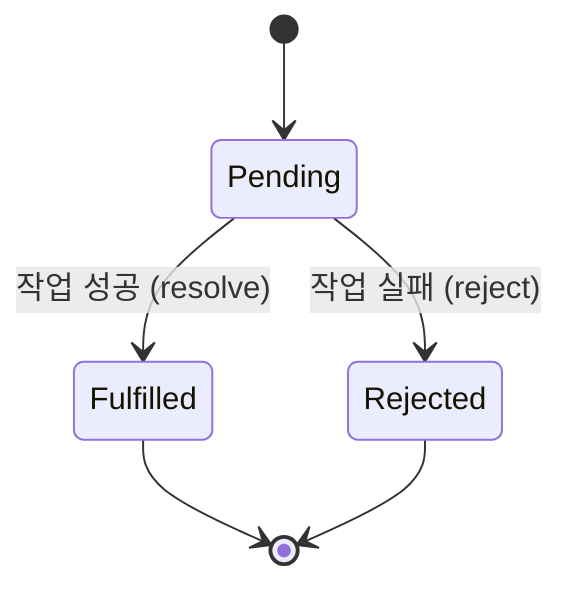

# 02. 프로미스 (Promise)

#프로미스 #promise #프라미스

ES6(ECMAScript 2015)에서 도입된 프로미스(Promise)는 콜백 패턴의 단점을 보완하고 비동기 코드를 더 깔끔하고 관리하기 쉽게 만들어주는 객체입니다. "언젠가 완료될 작업의 최종 결과를 나타내는 대리자"라고 할 수 있습니다.

---

## 1. 프로미스의 세 가지 상태

프로미스는 생성된 후 세 가지 상태 중 하나를 가집니다.

1.  **대기 (Pending)**: 초기 상태. 비동기 작업이 아직 완료되지 않았습니다.
2.  **이행 (Fulfilled)**: 비동기 작업이 성공적으로 완료되었습니다. `resolve` 함수가 호출된 상태이며, 결과값을 가집니다.
3.  **거부 (Rejected)**: 비동기 작업이 실패했습니다. `reject` 함수가 호출된 상태이며, 실패 원인(에러)을 가집니다.



- 프로미스는 한 번 `Fulfilled` 또는 `Rejected` 상태가 되면 더 이상 다른 상태로 변경되지 않습니다. (Settled 상태)

---

## 2. 프로미스 생성하기

`new Promise()` 생성자를 사용하여 프로미스 객체를 만듭니다. 생성자에는 `resolve`와 `reject` 두 개의 매개변수를 가진 실행 함수(executor)를 전달합니다.

- **`resolve(value)`**: 비동기 작업이 성공했을 때 호출하며, 결과 `value`를 전달합니다. 프로미스는 `Fulfilled` 상태가 됩니다.
- **`reject(error)`**: 비동기 작업이 실패했을 때 호출하며, 에러 `error`를 전달합니다. 프로미스는 `Rejected` 상태가 됩니다.

**코드 예시:**

```javascript
// 1초 뒤에 성공 또는 실패하는 프로미스를 생성하는 함수
function createPromise(taskSuccess) {
  return new Promise((resolve, reject) => {
    console.log("프로미스 작업 시작...");
    setTimeout(() => {
      if (taskSuccess) {
        // 작업 성공 시 resolve 호출
        resolve("작업 성공! 결과 데이터.");
      } else {
        // 작업 실패 시 reject 호출
        reject(new Error("작업 실패! 에러 발생."));
      }
    }, 1000);
  });
}
```

---

## 3. 프로미스 사용하기: `.then()`과 `.catch()`

생성된 프로미스는 `.then()`과 `.catch()` 메서드를 사용하여 후속 처리를 연결할 수 있습니다. 이를 **프로미스 체이닝(Promise Chaining)**이라고 합니다.

### 가. `.then(onFulfilled, onRejected)`

- 프로미스가 `Fulfilled` 상태가 되면 첫 번째 인자로 전달된 `onFulfilled` 함수가 실행됩니다. (성공 콜백)
- 프로미스가 `Rejected` 상태가 되면 두 번째 인자로 전달된 `onRejected` 함수가 실행됩니다. (실패 콜백)
- `.then()` 메서드는 **새로운 프로미스를 반환**하므로, 계속해서 체인을 연결할 수 있습니다.

### 나. `.catch(onRejected)`

- 프로미스가 `Rejected` 상태가 되었을 때 호출됩니다.
- `.then(null, onRejected)`와 동일한 역할을 하는 에러 처리 전용 단축 구문입니다. 가독성을 위해 에러 처리는 `.catch()`를 사용하는 것이 좋습니다.

**코드 예시:**

```javascript
// 위에서 만든 createPromise 함수 사용

// 1. 성공하는 경우
const successPromise = createPromise(true);

successPromise
  .then((result) => {
    // 성공 콜백
    console.log("성공:", result);
    return "다음 then으로 넘길 데이터"; // 이 값을 가진 새로운 프로미스가 반환됨
  })
  .then((nextResult) => {
    console.log("두 번째 then:", nextResult);
  })
  .catch((error) => {
    // 이 부분은 실행되지 않음
    console.error("실패:", error.message);
  });

// 2. 실패하는 경우
const failurePromise = createPromise(false);

failurePromise
  .then((result) => {
    // 이 부분은 실행되지 않음
    console.log("성공:", result);
  })
  .catch((error) => {
    // 실패 콜백 (reject가 호출되었으므로 이 부분이 실행됨)
    console.error("실패:", error.message);
  });
```

---

## 4. 콜백 지옥을 프로미스로 개선하기

이전 문서에서 봤던 '콜백 지옥' 코드를 프로미스를 사용하여 개선해 보겠습니다.

**개선 전 (콜백 지옥):**

```javascript
// addOne(0, (result1) => {
//   addOne(result1, (result2) => {
//     addOne(result2, (result3) => {
//       addOne(result3, (result4) => {
//         console.log("최종 결과:", result4);
//       });
//     });
//   });
// });
```

**개선 후 (프로미스 체이닝):**

```javascript
// 1초 뒤에 값을 1 더하고 resolve하는 프로미스를 반환하는 함수
function addOnePromise(value) {
  return new Promise((resolve) => {
    setTimeout(() => {
      const result = value + 1;
      console.log(`현재 값: ${value}, 1 더한 결과: ${result}`);
      resolve(result);
    }, 1000);
  });
}

// .then()을 통해 체인 형태로 연결
addOnePromise(0)
  .then((result1) => {
    return addOnePromise(result1); // 다음 then으로 프로미스를 반환
  })
  .then((result2) => {
    return addOnePromise(result2);
  })
  .then((result3) => {
    return addOnePromise(result3);
  })
  .then((result4) => {
    console.log("최종 결과:", result4);
  })
  .catch((error) => {
    // 중간에 에러가 발생하면 여기서 한 번에 처리 가능
    console.error("에러 발생:", error);
  });
```

프로미스 체이닝을 사용하면 중첩된 들여쓰기가 사라지고, 코드가 위에서 아래로 흐르는 것처럼 보여 가독성이 크게 향상됩니다. 또한, `.catch()`를 통해 체인 전체의 에러를 한 곳에서 효과적으로 관리할 수 있습니다.
