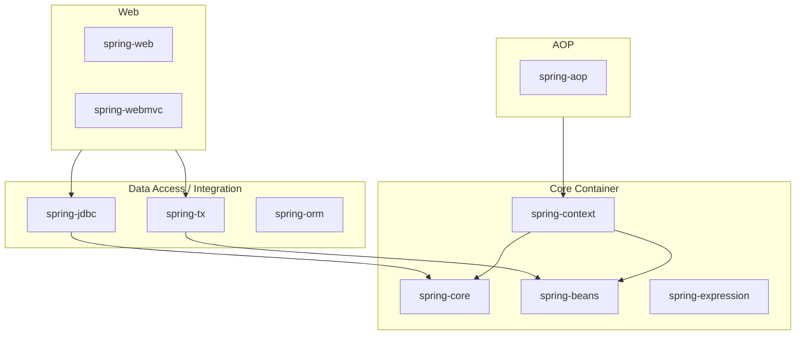

# 00. Spring Framework 개요

#spring #스프링 #framework #프레임워크

Spring Framework는 자바(Java) 플랫폼을 위한 오픈 소스 애플리케이션 프레임워크로, 현대적인 엔터프라이즈급 애플리케이션을 구축하는 데 필요한 포괄적인 인프라를 제공합니다. 이 문서는 Spring의 기본적인 정의, 목표, 그리고 핵심 구성 요소에 대해 설명합니다.

---

## 1. Spring Framework란?

- **정의**: 자바 플랫폼에서 동작하는 경량(Lightweight) 애플리케이션 프레임워크이자, **IoC(Inversion of Control) 컨테이너**입니다.
- **핵심 특징**: 객체를 **POJO(Plain Old Java Object)**, 즉 평범한 자바 객체로 유지하면서도 트랜잭션 관리, AOP(관점 지향 프로그래밍), 웹 MVC 등 복잡한 엔터프라이즈급 기능을 손쉽게 적용할 수 있도록 지원합니다.

---

## 2. Spring의 목표

Spring은 복잡한 엔터프라이즈 개발을 단순화하는 것을 주요 목표로 삼고 있으며, 다음과 같은 원칙을 추구합니다.

- **느슨한 결합 (Loose Coupling) 및 모듈화**: 객체 간의 의존성을 낮춰 코드의 재사용성을 높이고, 테스트와 유지보수 비용을 절감합니다.
- **선언적 프로그래밍 모델**: 비즈니스 로직과 부가 기능(횡단 관심사)을 분리하여 코드의 가독성과 유지보수성을 향상시킵니다. 대표적으로 AOP를 통해 로깅, 보안, 트랜잭션 등을 모듈화할 수 있습니다.
- **Jakarta EE (과거 Java EE) API 의존 최소화**: 특정 기술에 종속되지 않고 독립적으로 실행 가능한 경량 애플리케이션을 지향합니다.

---

## 3. 핵심 모듈 (계층)

Spring은 모듈화가 잘 되어 있어, 개발자가 필요한 기능만 선택하여 프로젝트에 포함할 수 있습니다. 이를 통해 의존성을 최소화하고 빌드 시간을 단축할 수 있습니다.

주요 모듈은 다음과 같은 계층으로 구성됩니다.

| 계층                 | 모듈                          | 역할                                                                                                                 |
| -------------------- | ----------------------------- | -------------------------------------------------------------------------------------------------------------------- |
| **Core Container**   | `spring-core`, `spring-beans` | **IoC/DI**의 기반을 제공하는 핵심 모듈입니다. Bean 팩토리와 Bean 생명주기를 관리합니다.                              |
| **Context**          | `spring-context`              | `ApplicationContext` 인터페이스를 제공하며, 국제화(i18n), 이벤트 처리, 메시지 소스 등 다양한 부가 기능을 지원합니다. |
| **AOP**              | `spring-aop`                  | 프록시(Proxy) 기반의 **관점 지향 프로그래밍(AOP)**을 구현하여 횡단 관심사를 분리할 수 있게 합니다.                   |
| **TX (Transaction)** | `spring-tx`                   | **선언적 트랜잭션 관리**를 지원합니다. `@Transactional` 애너테이션을 통해 간편하게 트랜잭션을 적용할 수 있습니다.    |
| **Web**              | `spring-web`, `spring-webmvc` | 서블릿(Servlet) 기반의 웹 애플리케이션과 RESTful 웹 서비스를 개발하기 위한 **Spring MVC** 프레임워크를 제공합니다.   |

이 외에도 데이터 접근을 위한 `spring-jdbc`, `spring-orm` 등 다양한 모듈이 존재하며, 프로젝트의 필요에 따라 선택적으로 조합하여 사용할 수 있습니다.
