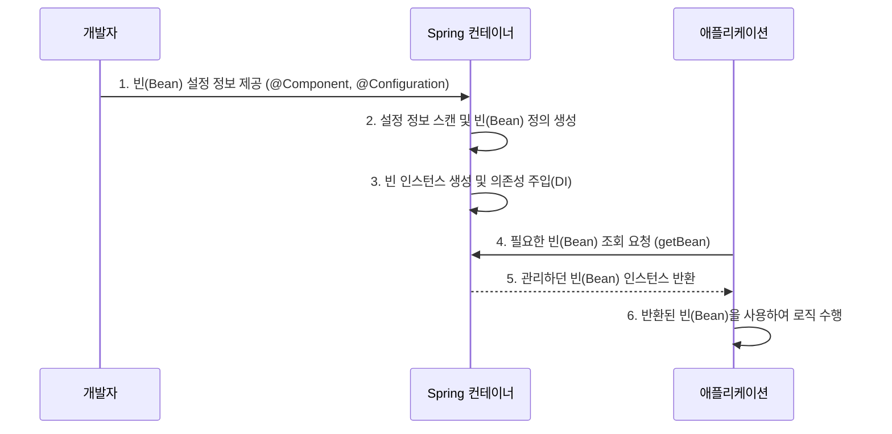

# 01. IoC와 DI

#ioc #제어의역전 #di #의존성주입

IoC(Inversion of Control)와 DI(Dependency Injection)는 Spring Framework의 가장 근간이 되는 핵심 원리입니다. 이 두 개념은 객체 지향 설계의 원칙을 충실히 따르면서, 코드의 유연성과 확장성을 극대화하는 데 중요한 역할을 합니다.

---

## 1. IoC (Inversion of Control, 제어의 역전)

- **정의**: 객체의 생성, 생명주기(Life Cycle), 의존성 관리 등 **객체에 대한 제어권**이 개발자로부터 **프레임워크(Spring 컨테이너)**로 넘어가는 것을 의미합니다.
- **전통적인 방식**: 개발자가 코드 내에서 `new` 키워드를 사용하여 직접 객체를 생성하고, 필요한 곳에 전달합니다. 객체 관리의 책임이 개발자에게 있습니다.
- **IoC 방식**: 개발자는 객체를 어떻게 만들고 연결할지에 대한 설정(예: XML, Annotation)만 제공합니다. 실제 객체 생성과 의존 관계 연결은 Spring 컨테이너가 담당합니다.

### IoC 컨테이너의 작동 순서

- **효과**:
  - **느슨한 결합(Loose Coupling)**: 컴포넌트들이 서로에 대해 최소한의 정보만 알게 되어, 하나의 변경이 다른 부분에 미치는 영향을 줄입니다.
  - **구현체 교체 용이**: 인터페이스 기반으로 코드를 작성하면, 설정 변경만으로 실제 구현 클래스를 쉽게 교체할 수 있습니다.
  - **단위 테스트 용이**: 의존성을 외부에서 주입받으므로, 테스트 시 실제 객체 대신 Mock(가짜) 객체를 주입하여 특정 부분만 독립적으로 테스트하기 편리합니다.

---

## 2. DI (Dependency Injection, 의존성 주입)

- **정의**: IoC를 구체적으로 구현하는 메커니즘입니다. 어떤 객체가 필요로 하는 다른 객체(의존성)를 **컨테이너가 외부에서 주입**해주는 디자인 패턴입니다. 객체는 자신이 사용할 의존성을 직접 생성하지 않습니다.

### DI의 세 가지 유형

Spring에서는 주로 세 가지 방식으로 의존성을 주입할 수 있습니다.

| 유형                                    | 선언 예시                | 특징 및 설명                                                                                                                                                                                                                                                                                                                                                                  |
| --------------------------------------- | ------------------------ | ----------------------------------------------------------------------------------------------------------------------------------------------------------------------------------------------------------------------------------------------------------------------------------------------------------------------------------------------------------------------------- |
| **생성자 주입 (Constructor Injection)** | `public Service(Repo r)` | - **가장 권장되는 방식**입니다. - **불변성(Immutability) 보장**: `final` 키워드를 사용할 수 있어, 한 번 주입된 의존성이 변경되지 않음을 보장합니다. - **순환 의존성 탐지**: 애플리케이션 시작 시점에 순환 참조 오류를 발견할 수 있습니다. - **의존성 누락 방지**: 객체 생성 시점에 반드시 의존성이 주입되어야 하므로 NullPointerException(NPE)을 방지할 수 있습니다. |
| **세터 주입 (Setter Injection)**        | `setRepo(Repo r)`        | - 선택적인 의존성을 주입할 때 사용됩니다. - 의존성이 없어도 객체 자체는 생성될 수 있습니다. - 주입받는 객체가 변경될 가능성이 있을 때 사용될 수 있지만, 일반적으로는 권장되지 않습니다.                                                                                                                                                                                 |
| **필드 주입 (Field Injection)**         | `@Autowired Repo r;`     | - 코드가 가장 간결하지만, 단점이 많아 **사용을 지양**해야 합니다. - 프레임워크에 강하게 결합되어 순수 자바 코드로 테스트하기 어렵습니다. - 외부에서 의존성을 주입하기 어려워 단위 테스트가 불편합니다. - `final` 키워드를 사용할 수 없어 불변성을 보장할 수 없습니다.                                                                                                |

### 왜 생성자 주입을 권장하는가?

Spring 공식 문서와 대부분의 숙련된 개발자들은 생성자 주입을 강력히 권장합니다. 그 이유는 명확한 의존 관계 표현, 불변성 확보, 테스트 용이성 등 객체 지향 설계의 원칙을 가장 잘 지킬 수 있는 방법이기 때문입니다.
