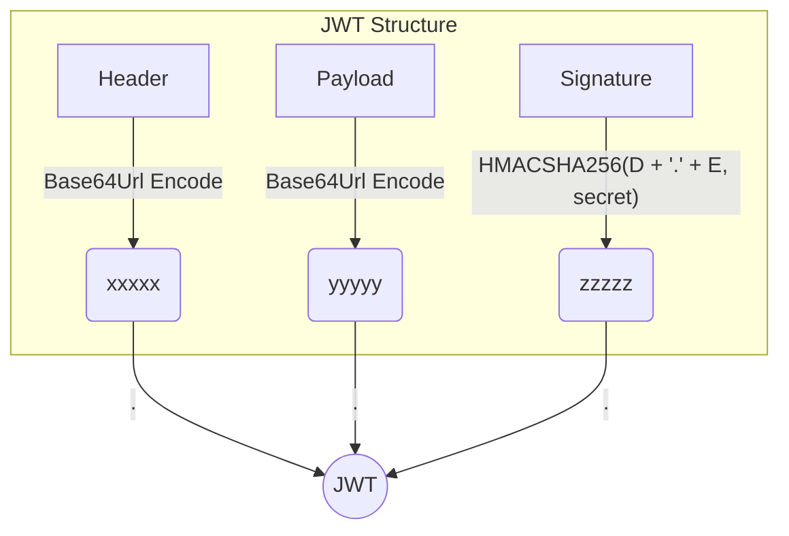
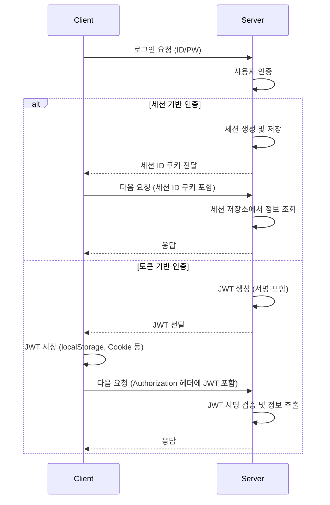

# 00. JWT 개요 및 기본 개념

#JWT #인증 #토큰 #Stateless #세션

## 1. JWT (JSON Web Token)란?

**JSON Web Token(JWT)**은 웹 표준(RFC 7519)으로서, 두 개체 사이에서 JSON 객체를 사용하여 가볍고 자가 수용적인(self-contained) 방식으로 정보를 안전하게 전달하는 방법입니다.

JWT는 주로 다음 세 가지 상황에서 사용됩니다.

1.  **인증 (Authentication)**: 사용자가 로그인하면 서버는 JWT를 발급합니다. 이후 사용자는 보호된 리소스에 접근할 때마다 이 토큰을 제시하여 자신의 신원을 증명합니다.
2.  **정보 교환 (Information Exchange)**: 두 개체 간에 정보를 안전하게 교환할 때 사용됩니다. JWT는 서명되어 있으므로, 정보가 변조되지 않았음을 신뢰할 수 있습니다.
3.  **인가 (Authorization)**: 사용자가 특정 리소스나 서비스에 접근할 수 있는 권한이 있는지 확인하는 데 사용됩니다.

### JWT의 구조

JWT는 `.`으로 구분된 세 부분으로 구성됩니다.

```
xxxxx.yyyyy.zzzzz
```

- **Header (헤더)**: 토큰의 유형(typ)과 서명 알고리즘(alg) 정보를 포함합니다.
- **Payload (페이로드)**: 토큰에 담을 정보(Claims)를 포함합니다. 사용자의 ID, 이름, 만료 시간(exp) 등을 저장합니다.
- **Signature (서명)**: 헤더와 페이로드를 합친 후, 서버의 비밀 키(Secret Key)로 암호화한 값입니다. 토큰의 위변조 여부 검증에 사용됩니다.



#### Header (헤더)

헤더는 보통 두 가지 정보를 가집니다.

- `typ`: 토큰의 유형을 지정합니다. (예: "JWT")
- `alg`: 서명 생성에 사용된 알고리즘을 지정합니다. (예: "HS256" 또는 "RS256")

```json
{
  "alg": "HS256",
  "typ": "JWT"
}
```

#### Payload (페이로드)

페이로드는 **클레임(Claim)**을 담고 있습니다. 클레임은 사용자에 대한 정보나 토큰에 대한 추가 데이터를 나타냅니다. 클레임에는 세 가지 유형이 있습니다.

- **Registered Claims (등록된 클레임)**: 필수는 아니지만 권장되는 미리 정의된 클레임 집합입니다.
  - `iss` (Issuer): 토큰 발급자
  - `sub` (Subject): 토큰 제목 (사용자 식별자)
  - `aud` (Audience): 토큰 대상자
  - `exp` (Expiration Time): 토큰 만료 시간
  - `nbf` (Not Before): 토큰 활성 날짜
  - `iat` (Issued At): 토큰 발급 시간
  - `jti` (JWT ID): JWT의 고유 식별자
- **Public Claims (공개 클레임)**: 충돌을 방지하기 위해 IANA JSON Web Token Registry에 정의되거나, URI 형식의 네임스페이스를 포함해야 합니다.
- **Private Claims (비공개 클레임)**: 클라이언트와 서버 간에 협의된 클레임입니다. (예: `username`, `roles`)

```json
{
  "sub": "user123",
  "name": "John Doe",
  "iat": 1516239022,
  "exp": 1516242622,
  "roles": ["USER", "ADMIN"]
}
```

> ⚠️ **주의**: 페이로드는 Base64Url로 인코딩될 뿐, 암호화되지 않습니다. 따라서 민감한 정보(예: 비밀번호)를 페이로드에 담아서는 안 됩니다.

#### Signature (서명)

서명은 인코딩된 헤더, 인코딩된 페이로드, 비밀 키, 그리고 헤더에 지정된 알고리즘을 사용하여 생성됩니다.

```
HMACSHA256(
  base64UrlEncode(header) + "." +
  base64UrlEncode(payload),
  secret
)
```

서명은 메시지가 도중에 변경되지 않았음을 확인하는 데 사용되며, 비밀 키를 가진 서버만이 유효한 토큰을 생성하고 검증할 수 있습니다.

## 2. 세션 기반 인증 vs. 토큰 기반 인증

| 구분          | 세션 기반 인증 (Stateful)                | 토큰 기반 인증 (Stateless)                         |
| :------------ | :--------------------------------------- | :------------------------------------------------- |
| **상태 저장** | 서버 메모리 또는 DB에 세션 정보 저장     | 서버에 상태 저장 안 함 (토큰 자체에 정보 포함)     |
| **확장성**    | 세션 공유(Sticky Session, Redis 등) 필요 | 로드밸런서 뒤에 서버 추가만으로 확장 용이          |
| **로그아웃**  | 서버에서 세션 무효화로 즉시 처리         | 토큰 만료 시간을 기다리거나 블랙리스트 관리 필요   |
| **저장소**    | 클라이언트는 세션 ID만 쿠키에 저장       | 클라이언트는 JWT를 쿠키, localStorage 등에 저장    |
| **보안**      | CSRF 공격에 취약할 수 있음               | XSS 공격으로 토큰 탈취 위험 (HttpOnly 쿠키로 완화) |
| **CORS**      | 동일 도메인에서는 문제 없음              | 다른 도메인 간 요청 시 CORS 설정 필수              |
| **토큰 크기** | 작음 (세션 ID)                           | 상대적으로 큼 (Payload 정보 포함)                  |



### 토큰 기반 인증의 장점

- **무상태성 (Stateless)**: 서버는 클라이언트의 상태를 유지할 필요가 없습니다. 각 요청은 필요한 모든 정보를 담고 있으므로, 서버는 토큰의 유효성만 검증하면 됩니다.
- **확장성 (Scalability)**: 상태를 저장하지 않으므로 서버를 수평적으로 확장하기 용이합니다. 어떤 서버로 요청이 가든 토큰만 유효하면 처리가 가능합니다.
- **유연성 (Flexibility)**: 웹, 모바일 등 다양한 클라이언트 환경에서 쉽게 사용될 수 있습니다.
- **CORS 처리 용이**: 토큰을 HTTP 헤더에 담아 전송하므로, 다른 도메인 간의 API 호출 시 CORS 문제를 더 유연하게 처리할 수 있습니다.

### 토큰 기반 인증의 단점

- **토큰 탈취**: 토큰이 탈취되면 공격자가 사용자 행세를 할 수 있습니다. (HttpOnly 쿠키, 짧은 만료 시간, Refresh Token 등으로 보완)
- **상태 관리의 어려움**: 강제 로그아웃, 특정 사용자 세션 제어 등이 어렵습니다. (토큰 블랙리스트, DB 조회 등으로 보완 가능)
- **토큰 크기**: 페이로드에 담는 정보가 많아질수록 토큰의 크기가 커져 네트워크 오버헤드가 발생할 수 있습니다.
- **만료 시간 관리**: 토큰의 만료 시간을 너무 길게 설정하면 보안에 취약하고, 너무 짧게 설정하면 사용자가 자주 재로그인해야 하는 불편함이 있습니다. (Refresh Token 패턴으로 해결)
