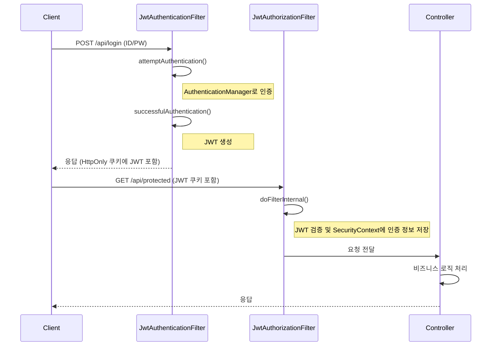

# 02. JWT 필터와 인증 흐름

#SpringSecurity #JWT #Filter #OncePerRequestFilter #Authentication

Spring Security는 서블릿 필터 체인을 기반으로 동작합니다. JWT 인증을 구현한다는 것은 이 필터 체인에 우리가 직접 만든 커스텀 필터를 추가하여 인증 로직을 제어하는 것을 의미합니다.

여기서는 두 가지 주요 필터를 구현합니다.

1.  **`JwtAuthenticationFilter`**: 로그인(`POST /login`) 요청을 처리하여 사용자 인증을 수행하고, 성공 시 JWT를 발급합니다.
2.  **`JwtAuthorizationFilter`**: 로그인 이외의 모든 요청에 대해 헤더나 쿠키에 포함된 JWT를 검증하고, 유효한 경우 `SecurityContext`에 인증 정보를 설정합니다.

## 1. `JwtAuthenticationFilter` (인증 및 토큰 발급)

이 필터는 `UsernamePasswordAuthenticationFilter`를 상속받아 구현합니다. 이 필터는 특정 URL(기본값: `/login`)로 들어오는 `POST` 요청을 가로채서 인증을 시도합니다.

### 구현 단계

1.  `attemptAuthentication()`: 요청 본문에서 username과 password를 추출하여 `UsernamePasswordAuthenticationToken`을 생성하고, `AuthenticationManager`에 인증을 위임합니다.
2.  `successfulAuthentication()`: 인증이 성공하면 호출됩니다. `Authentication` 객체로부터 사용자 정보를 가져와 `JwtUtil`을 통해 JWT(AccessToken)를 생성합니다. 생성된 토큰은 응답 헤더나 쿠키에 담아 클라이언트에 전달합니다.
3.  `unsuccessfulAuthentication()`: 인증이 실패하면 호출됩니다. 실패 응답(예: 401 Unauthorized)을 보냅니다.

### `JwtAuthenticationFilter.java`

```java
// filter/JwtAuthenticationFilter.java
package com.example.jwt.filter;

import com.example.jwt.util.CookieUtil;
import com.example.jwt.util.JwtUtil;
import jakarta.servlet.FilterChain;
import jakarta.servlet.http.HttpServletRequest;
import jakarta.servlet.http.HttpServletResponse;
import lombok.RequiredArgsConstructor;
import org.springframework.security.authentication.AuthenticationManager;
import org.springframework.security.authentication.UsernamePasswordAuthenticationToken;
import org.springframework.security.core.Authentication;
import org.springframework.security.core.AuthenticationException;
import org.springframework.security.core.userdetails.User;
import org.springframework.security.web.authentication.UsernamePasswordAuthenticationFilter;

import java.io.IOException;

@RequiredArgsConstructor
public class JwtAuthenticationFilter extends UsernamePasswordAuthenticationFilter {

    private final AuthenticationManager authenticationManager;
    private final JwtUtil jwtUtil;

    @Override
    public Authentication attemptAuthentication(HttpServletRequest request, HttpServletResponse response) throws AuthenticationException {
        String username = obtainUsername(request);
        String password = obtainPassword(request);

        UsernamePasswordAuthenticationToken authToken = new UsernamePasswordAuthenticationToken(username, password, null);
        return authenticationManager.authenticate(authToken);
    }

    @Override
    protected void successfulAuthentication(HttpServletRequest request, HttpServletResponse response, FilterChain chain, Authentication authResult) throws IOException {
        User user = (User) authResult.getPrincipal();
        String accessToken = jwtUtil.createAccessToken(user.getUsername());

        // HttpOnly 쿠키에 AccessToken 저장
        long expiration = jwtUtil.getAccessTokenExpiration();
        CookieUtil.addCookie(response, "accessToken", accessToken, (int) (expiration / 1000));

        response.setStatus(HttpServletResponse.SC_OK);
        response.getWriter().write("Login successful. Welcome " + user.getUsername());
        response.getWriter().flush();
    }

    @Override
    protected void unsuccessfulAuthentication(HttpServletRequest request, HttpServletResponse response, AuthenticationException failed) throws IOException {
        response.setStatus(HttpServletResponse.SC_UNAUTHORIZED);
        response.getWriter().write("Login failed: " + failed.getMessage());
        response.getWriter().flush();
    }
}
```

> 💡 **토큰 전달 방식**: 여기서는 보안 강화를 위해 JavaScript에서 접근할 수 없는 **HttpOnly 쿠키**를 사용했습니다. REST API 환경에서는 응답 본문에 JSON 형태로 토큰을 담아 전달하고, 클라이언트(예: 모바일 앱)가 직접 관리하는 방식도 많이 사용됩니다.

## 2. `JwtAuthorizationFilter` (인가 및 토큰 검증)

이 필터는 `OncePerRequestFilter`를 상속받아 구현합니다. 이름처럼 모든 요청에 대해 **한 번만** 실행되는 것을 보장합니다.

### 구현 단계

1.  `doFilterInternal()`: 요청 헤더나 쿠키에서 JWT를 추출합니다.
2.  토큰이 존재하고 `JwtUtil`을 통해 유효성이 검증되면, 토큰에서 사용자 정보를 추출합니다.
3.  추출된 사용자 정보로 `UsernamePasswordAuthenticationToken`을 생성합니다. (이때 비밀번호는 `null`로 설정)
4.  생성된 `Authentication` 객체를 `SecurityContextHolder.getContext().setAuthentication()`을 통해 `SecurityContext`에 저장합니다.
5.  `SecurityContext`에 `Authentication` 객체가 저장되면, Spring Security는 해당 사용자를 **인증된 사용자**로 간주합니다.

### `JwtAuthorizationFilter.java`

```java
// filter/JwtAuthorizationFilter.java
package com.example.jwt.filter;

import com.example.jwt.util.CookieUtil;
import com.example.jwt.util.JwtUtil;
import jakarta.servlet.FilterChain;
import jakarta.servlet.ServletException;
import jakarta.servlet.http.HttpServletRequest;
import jakarta.servlet.http.HttpServletResponse;
import lombok.RequiredArgsConstructor;
import org.springframework.security.authentication.UsernamePasswordAuthenticationToken;
import org.springframework.security.core.authority.SimpleGrantedAuthority;
import org.springframework.security.core.context.SecurityContextHolder;
import org.springframework.util.StringUtils;
import org.springframework.web.filter.OncePerRequestFilter;

import java.io.IOException;
import java.util.Collections;
import java.util.Optional;

@RequiredArgsConstructor
public class JwtAuthorizationFilter extends OncePerRequestFilter {

    private final JwtUtil jwtUtil;

    @Override
    protected void doFilterInternal(HttpServletRequest request, HttpServletResponse response, FilterChain filterChain) throws ServletException, IOException {
        // 1. 쿠키에서 토큰 가져오기
        Optional<String> tokenFromCookie = CookieUtil.getCookie(request, "accessToken");
        String token = tokenFromCookie.orElse(resolveTokenFromHeader(request));

        // 2. 토큰 유효성 검증
        if (StringUtils.hasText(token) && jwtUtil.validateToken(token)) {
            // 3. 토큰에서 사용자 정보 추출 및 Authentication 객체 생성
            String username = jwtUtil.getUsernameFromToken(token);
            UsernamePasswordAuthenticationToken authentication = new UsernamePasswordAuthenticationToken(
                    username, null, Collections.singletonList(new SimpleGrantedAuthority("ROLE_USER"))
            );
            // 4. SecurityContext에 인증 정보 저장
            SecurityContextHolder.getContext().setAuthentication(authentication);
        }

        // 5. 다음 필터로 요청 전달
        filterChain.doFilter(request, response);
    }

    // Authorization 헤더에서 토큰 추출
    private String resolveTokenFromHeader(HttpServletRequest request) {
        String bearerToken = request.getHeader("Authorization");
        if (StringUtils.hasText(bearerToken) && bearerToken.startsWith("Bearer ")) {
            return bearerToken.substring(7);
        }
        return null;
    }
}
```

## 3. `SecurityConfig`에 필터 등록

`SecurityConfig`에서 생성한 커스텀 필터들을 필터 체인에 등록합니다.

```java
// config/SecurityConfig.java
@Configuration
@EnableWebSecurity
@RequiredArgsConstructor
public class SecurityConfig {

    private final JwtUtil jwtUtil;
    private final AuthenticationConfiguration authenticationConfiguration;

    // ... (PasswordEncoder, AuthenticationManager, UserDetailsService Beans)

    @Bean
    public SecurityFilterChain securityFilterChain(HttpSecurity http) throws Exception {
        // CSRF, 세션, 폼 로그인, HTTP Basic 비활성화
        http.csrf(AbstractHttpConfigurer::disable)
            .sessionManagement(session -> session.sessionCreationPolicy(SessionCreationPolicy.STATELESS))
            .formLogin(AbstractHttpConfigurer::disable)
            .httpBasic(AbstractHttpConfigurer::disable);

        // URL별 접근 권한 설정
        http.authorizeHttpRequests(auth -> auth
                .requestMatchers("/login", "/api/login").permitAll()
                .anyRequest().authenticated());

        // JwtAuthenticationFilter 등록 (UsernamePasswordAuthenticationFilter 자리에)
        JwtAuthenticationFilter jwtAuthenticationFilter = new JwtAuthenticationFilter(authenticationManager(authenticationConfiguration), jwtUtil);
        jwtAuthenticationFilter.setFilterProcessesUrl("/api/login"); // 로그인 처리 URL 설정
        http.addFilterAt(jwtAuthenticationFilter, UsernamePasswordAuthenticationFilter.class);

        // JwtAuthorizationFilter 등록 (JwtAuthenticationFilter 앞에)
        http.addFilterBefore(new JwtAuthorizationFilter(jwtUtil), JwtAuthenticationFilter.class);

        return http.build();
    }
}
```

### 필터 등록 순서

- `addFilterAt(filter, at)`: 지정된 필터(`at`)의 위치에 새로운 필터(`filter`)를 추가합니다.
- `addFilterBefore(filter, before)`: 지정된 필터(`before`) 앞에 새로운 필터를 추가합니다.

여기서는 `JwtAuthenticationFilter`가 `UsernamePasswordAuthenticationFilter`의 역할을 대체하도록 `addFilterAt`을 사용했고, 모든 요청에 대해 토큰을 먼저 검증해야 하므로 `JwtAuthorizationFilter`를 `JwtAuthenticationFilter` 앞에 `addFilterBefore`로 추가했습니다.

## 4. 전체 인증 흐름



이처럼 커스텀 필터를 구현하면 Spring Security의 인증 흐름을 명확하게 이해하고, 비즈니스 요구사항에 맞게 유연하게 제어할 수 있습니다.
