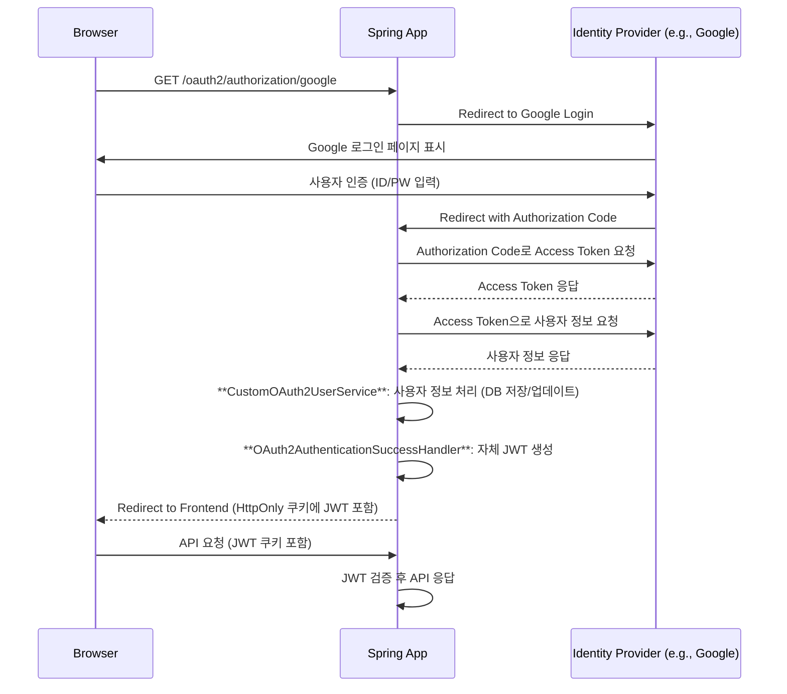

# 04. OAuth2와 JWT 통합

#OAuth2 #SocialLogin #Google #GitHub #JWT

OAuth2 소셜 로그인은 사용자에게 편리한 로그인 경험을 제공하는 강력한 기능입니다. Spring Security는 OAuth2 클라이언트 기능을 완벽하게 지원하며, 이를 우리가 만든 JWT 인증 시스템과 쉽게 통합할 수 있습니다.

## 1. 통합 시나리오

OAuth2 소셜 로그인과 JWT를 통합하는 목표는 다음과 같습니다.

> **"외부 ID Provider(Google, GitHub 등)를 통해 사용자를 인증하고, 인증이 성공하면 우리 애플리케이션의 자체 JWT를 발급한다."**

이렇게 하면 **소셜 로그인 사용자**와 **일반 ID/PW 로그인 사용자**를 동일한 JWT 인증 메커니즘으로 관리할 수 있습니다.

### 인증 흐름



## 2. 의존성 및 `application.yml` 설정

### 의존성 추가

`spring-boot-starter-oauth2-client` 의존성을 추가합니다.

```groovy
// build.gradle
dependencies {
    // ... 기존 JWT, Security 의존성
    implementation 'org.springframework.boot:spring-boot-starter-oauth2-client'
}
```

### `application.yml` 설정

Google, GitHub 등 사용할 Provider의 `client-id`와 `client-secret`을 등록합니다.

```yaml
# src/main/resources/application.yml
spring:
  security:
    oauth2:
      client:
        registration:
          google:
            client-id: ${GOOGLE_CLIENT_ID}
            client-secret: ${GOOGLE_CLIENT_SECRET}
            scope:
              - profile
              - email
          github:
            client-id: ${GITHUB_CLIENT_ID}
            client-secret: ${GITHUB_CLIENT_SECRET}
            scope:
              - read:user
              - user:email
        # GitHub는 provider 정보가 자동 구성되지 않으므로 수동 추가
        provider:
          github:
            authorization-uri: https://github.com/login/oauth/authorize
            token-uri: https://github.com/login/oauth/access_token
            user-info-uri: https://api.github.com/user
            user-name-attribute: id # 사용자 정보를 식별할 속성
```

> 💡 **환경 변수 설정**: `GOOGLE_CLIENT_ID`, `GITHUB_CLIENT_SECRET` 등은 민감 정보이므로, IDE의 실행 구성(Run Configuration)이나 OS 환경 변수를 통해 주입하는 것이 안전합니다.

## 3. `SecurityConfig` 수정

`SecurityConfig`에 `oauth2Login()` 설정을 추가하고, 로그인 성공 시 JWT를 발급하는 `AuthenticationSuccessHandler`를 연결합니다.

```java
// config/SecurityConfig.java
@Configuration
@EnableWebSecurity
@RequiredArgsConstructor
public class SecurityConfig {

    private final CustomOAuth2UserService customOAuth2UserService;
    private final OAuth2AuthenticationSuccessHandler oAuth2AuthenticationSuccessHandler;

    @Bean
    public SecurityFilterChain securityFilterChain(HttpSecurity http) throws Exception {
        http
            // ... (csrf, sessionManagement 등 기존 설정)
            .authorizeHttpRequests(auth -> auth
                .requestMatchers("/login", "/oauth2/**").permitAll() // OAuth2 관련 경로 허용
                .anyRequest().authenticated()
            )
            .oauth2Login(oauth2 -> oauth2
                .userInfoEndpoint(userInfo -> userInfo
                    .userService(customOAuth2UserService) // 1. 사용자 정보 처리
                )
                .successHandler(oAuth2AuthenticationSuccessHandler) // 2. JWT 발급
            );
            // ... (JWT 필터 등록 등 기존 설정)

        return http.build();
    }
}
```

## 4. `CustomOAuth2UserService` 구현

OAuth2 Provider로부터 받은 사용자 정보를 우리 시스템에 맞게 처리하는 역할을 합니다. 예를 들어, 처음 로그인한 사용자는 DB에 새로 저장하고, 기존 사용자는 정보를 업데이트할 수 있습니다.

- `loadUser()`: Spring Security에 의해 호출되며, Provider로부터 받은 `OAuth2User` 정보를 가공하여 반환합니다.
- Provider별로 상이한 사용자 정보(`attributes`) 구조를 파싱하여 일관된 형태로 만듭니다.

```java
// service/CustomOAuth2UserService.java
package com.example.jwt.service;

import com.example.jwt.domain.User;
import com.example.jwt.repository.UserRepository;
import lombok.RequiredArgsConstructor;
import org.springframework.security.oauth2.client.userinfo.DefaultOAuth2UserService;
import org.springframework.security.oauth2.client.userinfo.OAuth2UserRequest;
import org.springframework.security.oauth2.core.OAuth2AuthenticationException;
import org.springframework.security.oauth2.core.user.OAuth2User;
import org.springframework.stereotype.Service;
import org.springframework.transaction.annotation.Transactional;

import java.util.Map;
import java.util.Optional;

@Service
@RequiredArgsConstructor
public class CustomOAuth2UserService extends DefaultOAuth2UserService {

    private final UserRepository userRepository;

    @Override
    @Transactional
    public OAuth2User loadUser(OAuth2UserRequest userRequest) throws OAuth2AuthenticationException {
        OAuth2User oAuth2User = super.loadUser(userRequest);
        String provider = userRequest.getClientRegistration().getRegistrationId();
        Map<String, Object> attributes = oAuth2User.getAttributes();

        // Provider별로 사용자 정보 추출
        String email = extractEmail(provider, attributes);
        String username = provider + "_" + attributes.get(userRequest.getClientRegistration().getProviderDetails().getUserInfoEndpoint().getUserNameAttributeName());

        // DB에서 사용자 조회 또는 신규 생성
        User user = userRepository.findByUsername(username)
                .orElseGet(() -> {
                    User newUser = User.builder()
                            .username(username)
                            .email(email)
                            .provider(provider)
                            .build();
                    return userRepository.save(newUser);
                });

        // Spring Security가 인식할 수 있는 형태로 반환
        return new CustomOAuth2User(user, attributes);
    }

    private String extractEmail(String provider, Map<String, Object> attributes) {
        return switch (provider) {
            case "google" -> (String) attributes.get("email");
            case "github" -> Optional.ofNullable((String) attributes.get("email"))
                                     .orElse((String) attributes.get("login") + "@github.com");
            default -> throw new OAuth2AuthenticationException("Unsupported provider: " + provider);
        };
    }
}
```

### `CustomOAuth2User.java`

`OAuth2User` 인터페이스를 구현하여 우리 시스템의 `User` 엔티티와 Provider의 `attributes`를 함께 관리합니다.

```java
// domain/CustomOAuth2User.java
public class CustomOAuth2User implements OAuth2User {
    private final User user;
    private final Map<String, Object> attributes;

    // ... (생성자, getter)

    @Override
    public String getName() {
        return user.getUsername(); // SecurityContext에서 authentication.getName()으로 사용될 값
    }
}
```

## 5. `OAuth2AuthenticationSuccessHandler` 구현

인증이 최종 성공한 후 호출되어, 우리 시스템의 JWT를 생성하고 클라이언트에 전달하는 역할을 합니다.

```java
// handler/OAuth2AuthenticationSuccessHandler.java
package com.example.jwt.handler;

import com.example.jwt.service.JwtTokenService;
import com.example.jwt.util.CookieUtil;
import jakarta.servlet.http.HttpServletRequest;
import jakarta.servlet.http.HttpServletResponse;
import lombok.RequiredArgsConstructor;
import org.springframework.security.core.Authentication;
import org.springframework.security.web.authentication.SimpleUrlAuthenticationSuccessHandler;
import org.springframework.stereotype.Component;

import java.io.IOException;

@Component
@RequiredArgsConstructor
public class OAuth2AuthenticationSuccessHandler extends SimpleUrlAuthenticationSuccessHandler {

    private final JwtTokenService jwtTokenService;

    @Override
    public void onAuthenticationSuccess(HttpServletRequest request, HttpServletResponse response, Authentication authentication) throws IOException {
        // 1. 인증된 사용자 정보로 JWT 생성
        String accessToken = jwtTokenService.createAccessToken(authentication.getName());

        // 2. HttpOnly 쿠키에 JWT 저장
        CookieUtil.addCookie(response, "accessToken", accessToken, 3600);

        // 3. 프론트엔드 페이지로 리다이렉트
        String targetUrl = determineTargetUrl(request, response, authentication);
        getRedirectStrategy().sendRedirect(request, response, targetUrl);
    }

    @Override
    protected String determineTargetUrl(HttpServletRequest request, HttpServletResponse response, Authentication authentication) {
        // 로그인 성공 후 리다이렉트할 URL 지정
        return "http://localhost:3000/login-success";
    }
}
```

이제 소셜 로그인 버튼을 클릭하면, 성공적으로 인증된 후 프론트엔드 페이지로 리다이렉트되며 브라우저에는 우리 시스템의 JWT가 담긴 `HttpOnly` 쿠키가 저장됩니다. 이후의 모든 API 요청은 이 쿠키를 통해 자동으로 인증됩니다.
